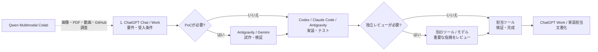

# Multi-AI Workflow Architecture

[English](README.md) | [日本語](README.ja.md)

調査、思考、初期実装、本実装、独立レビュー、マルチモーダル実験を、ChatGPT、Codex、Claude Code、Gemini・Antigravity、Qwen Colabで分担する運用ガイドです。

---

# Multi-AI Workflow Architecture

複数のAIを「1つの万能モデル」として使うのではなく、**思考・初期実装・本実装・独立レビュー・マルチモーダル実験**に役割分担させるための運用リポジトリです。

対象はプログラミングだけではありません。技術調査、文章・資料作成、設計、レビュー、画像・PDF・動画の理解や生成までを、ChatGPT / Codex / Claude Code / Gemini + Antigravity / Qwen Multimodal Colab で使い分けます。

> **Model snapshot: 2026-09-30**
>
> - ChatGPT Chat / Work: 自分の運用では GPT-6 Luna を標準とし、より深い推論が必要なときだけ GPT-6 Sol へ上げる
> - Codex: GPT-6 Luna を主力実装、GPT-6 Sol を難しい実装へのエスカレーション、GPT-6 Astra を最終手段に使用
> - Claude Code: Claude Opus 5.5 を主力として使用し、通常は Medium effort。Sonnet 5 は利用枠温存や軽めの代替実装に使用
> - Google Antigravity: Gemini 3.8 Flash をPoC、実装、複数ファイル変更、反復作業の候補に使用
> - Qwen Multimodal Colab: Google Colab上の個人用マルチモーダル環境。Qwen3.8-27B Q8_K_L + Qwen-Image-2.1で、Chat / Vision / 画像生成・編集 / PDF / 短い動画 / 音声入力 / GitHub読解に使用
> - Ollama / ローカルLLM: 現在は日常運用していない。旧設定はLegacyとしてのみ保持
>
> モデル更新が速いため、**製品名より役割を固定し、モデルは差し替え可能にする**のが基本方針です。利用可能なモデル・利用枠は契約と画面で確認します。
>
> READMEでは、更新負担の大きい静的なアーキテクチャ画像は表示せず、テキストとMermaidで構成を管理します。

---

## 1. AIチームと呼び方

この構成では、ユーザーをProduct Owner、**ドッティ（Dottie）をPM / AIオーケストレーター**として扱います。実装・調査・レビューを担当するAIは「エンジニアチーム」です。

| 呼び方 | 実体 | チーム内の役割 |
|---|---|---|
| **ドッティ** | OpenAI Dots | PM / オーケストレーター。仕事の分解、担当選定、利用枠管理、進捗・レビュー調整 |
| **チャッピー** | ChatGPT + Codex | アーキテクト / OpenAI側エンジニア。要件・設計・調査・文章・Codex実装 |
| **クロード** | Claude Code | シニアエンジニア / レビュアー。難しい実装、長時間作業、独立レビュー |
| **ジェミナイ** | Gemini 3.8 Flash + Antigravity | 高速実装 / PoC担当。初期実装、大量・反復作業 |
| **クエン** | Qwen Multimodal Colab | マルチモーダル / 調査担当。画像・PDF・動画・音声・Read-only調査 |

詳細は [AI Team: Names, Roles, and Operating Model](docs/ai-team.md) を参照してください。

### Dottieの実行環境

- **Dottie's cloud computer**: 常時稼働するPM本体
- **Windowsデスクトップ**: 常時起動のローカル基地。ローカル接続後はCodexBarやCLI状態への橋として優先
- **MacBook Air**: 外出・対話作業用のセカンダリローカル端末
- ローカルPCがオフラインでも、Dottie自身はクラウド側で継続して動ける構成を目指す

---

## 2. 現在の役割分担

| 役割 | 主担当 | 主な用途 |
|---|---|---|
| **相談・短い下書き** | ChatGPT Chat | 要件の壁打ち、選択肢の整理、短い回答 |
| **非コード成果物** | ChatGPT Work | 出典付き調査、文書・資料・レポートの作成と確認 |
| **探索・実装の候補** | Gemini 3.8 Flash + Antigravity | PoC、UI試作、複数ファイル変更、反復作業。完成条件とテストを指定する |
| **主力実装** | Codex + GPT-6 Luna (Medium) | 通常の機能実装、複数ファイル変更、テスト、レビュー指摘の反映 |
| **上位実装 / 難問** | Codex + GPT-6 Sol (Medium) | Lunaで不足する設計判断、難しいデバッグ、複雑なリファクタリング |
| **主力Claude / 独立レビュー** | Claude Code + Opus 5.5 (Medium) | 難しい実装、長時間作業、コードベース横断レビュー、セカンドオピニオン |
| **Claudeの節約枠** | Claude Code + Sonnet 5 | Opusの利用枠を温存したい軽めの実装・代替実装 |
| **最終エスカレーション** | GPT-6 Astra | Sol / Opus 5.5でも解けない高難度問題 |
| **個人用マルチモーダル環境** | [Qwen Multimodal Colab](https://github.com/moruku36/qwen-multimodal-colab) | Chat / Vision、画像生成・編集、PDF・短い動画の読解、音声入力、GitHubのRead-only調査 |

---

## 3. 基本開発フロー

新規プロジェクトや大きめの機能追加では、仕様と受入条件を決め、必要な工程だけ各ツールに依頼します。既存コードの修正はPoCを挟まず実装担当へ渡せます。



### 原則

1. **PoCは不確実性があるときに挟む**
   - UI案や技術選定を試す。既存コードの明確な修正では省略する。
2. **同じ担当が実装と検証を完了できるようにする**
   - 設計との整合、テスト、差分確認まで依頼する。ツールを渡すだけで品質が上がるとはみなさない。
3. **重要な変更は独立レビューを検討する**
   - 実装担当と異なるツールを使い、根拠と再現手順を求める。指摘は実装担当が検証する。
4. **CodexはLunaを標準にする**
   - 通常作業はGPT-6 Luna Mediumから開始し、難しい設計判断・デバッグで不足したときだけSol Mediumへ上げる。
5. **Astraは最後まで温存する**
   - GPT-6 Sol / Opus 5.5で解けない問題、非常に重要な最終判断のみ。
6. **DottieはCodexBarを利用量の観測レイヤーとして使う（接続検証中）**
   - CodexBarのCLI/Hookから利用率・リセット時刻・provider statusだけを正規化し、DottieがCodex / Claude Code / Antigravity / Qwen Colabをquota-awareに振り分ける。認証トークンやCookieはDotsへ渡さない。詳細は [Dots + CodexBar Orchestration Plan](docs/dots-codexbar-orchestration.md)。

---

## 4. タスク別の使い分け

| タスク | 第一候補 | 第二候補 |
|---|---|---|
| アイデア整理・要件定義 | ChatGPT Chat / Work | Claude（別の視点が必要な場合） |
| 技術調査・比較・レポート | ChatGPT Work | ChatGPT Chat（短い比較） |
| 文章・資料作成 | ChatGPT Work | ChatGPT Chat（短い下書き） |
| PoC / モック / 新規プロジェクトの土台 | Gemini 3.8 Flash | Claude Sonnet 5 |
| 大量の定型修正 | Gemini 3.8 Flash | GPT-6 Luna |
| 小さなコード修正 | GPT-6 Luna | Gemini 3.8 Flash |
| 通常の機能実装 | GPT-6 Luna (Medium) | Claude Opus 5.5 (Medium) |
| 難しい機能実装・デバッグ | GPT-6 Sol (Medium) | Claude Opus 5.5 (Medium) |
| 大規模migration / 長時間の自律作業 | Claude Code / Opus 5.5 (Medium) | Codex / GPT-6 Sol |
| 独立コードレビュー | Claude Code / Opus 5.5 (Medium) | Codex / GPT-6 Sol |
| 最終的な難問 | GPT-6 Astra | Claude Opus 5.5 |
| 画像理解・画像生成/編集・PDF/短動画・音声入力 | Qwen Multimodal Colab | ChatGPT / Gemini（用途に応じて） |
| GitHubリポジトリのRead-only調査 | Qwen Multimodal Colab | ChatGPT / Codex |

詳細は [Routing Guide](docs/routing-guide.md) を参照してください。

---

## 5. 利用枠を守るためのルール

### Codexの利用枠を温存する

- **デフォルトは GPT-6 Luna / Medium**。Lowは単純修正・大量の定型作業でさらに節約したい場合に使う。
- Lunaで不足したときだけ **GPT-6 Sol / Medium** へ昇格する。
- Solでも解けない高難度問題だけAstraを検討する。
- 初期モックや探索的実装は Antigravity + Gemini 3.8 Flash も候補にする。

### Claude Codeの利用枠を温存する

- **デフォルトは Opus 5.5 / Medium**。最近の実運用で品質と安定感が良いため、Claude側の主力とする。
- Lowは単純作業や利用枠を強く節約したい場合に使う。
- High以上は難バグ・大規模設計・重要レビューなど、Mediumで不足した場合だけ上げる。
- Sonnet 5はOpusの利用枠を温存したい軽量実装・代替実装に使う。
- Codexで既に実装済みなら、Claude側は「重大な問題だけレビュー」とスコープを絞る。

### Effortの標準

| モデル | 標準 | 上げる条件 |
|---|---|---|
| GPT-6 Luna | **Medium** | 基本はそのまま。単純作業だけLow |
| GPT-6 Sol | **Medium** | Lunaで不足した場合にモデルごと昇格 |
| Claude Opus 5.5 | **Medium** | 難バグ・大規模設計・重要レビューで必要ならHigh |
| Claude Sonnet 5 | Low〜Medium | 軽量実装・利用枠温存 |

### 同じ仕事を二重発注しない

CodexとClaude Codeの両方に、同じ機能をゼロから実装させるのは原則避けます。

- Builder: Codex → Reviewer: Claude Code
- Builder: Claude Code → Reviewer: Codex

という**クロスレビュー**を基本にします。

---

## 6. 非コード作業の基本フロー

文章・資料・調査では、短い相談にChat、完成した成果物の作成にWorkを使います。

1. **ChatGPT Chat / Work**: 論点整理、出典確認、構成、初稿
2. **Gemini / Antigravity**: 必要ならファイル化・大量整形・反復作業
3. **Claude Opus 5.5**: 重要成果物のみ独立レビュー
4. **ChatGPT Work**: 最終版へ統合し、事実と出典を確認

Qwen Multimodal ColabはGoogle Colab / Google Drive / 外部検索サービスを利用し得るため、**ローカルLLMのような機密データ保護境界としては扱いません**。機密情報は所属組織やサービスの利用ルールに従い、投入可否を個別に判断します。

---

## 7. 実践レシピ集

- [レシピ 01: 議事録・商談メモの高速処理＆リスク検証](docs/cookbook/01-meeting-minutes.md)
- [レシピ 02: 新技術・OSSの選定と比較レポート作成](docs/cookbook/02-tech-selection.md)
- [レシピ 03: 対外発信・プレスリリースの推敲＆リスクチェック](docs/cookbook/03-press-release.md)
- [レシピ 04: コード実装・リファクタリング・独立レビュー](docs/cookbook/04-code-refactor.md)

モデル間の引き継ぎには [Handoff Templates](docs/handoff-templates.md) を使用します。AIチームの呼称・役割は [AI Team](docs/ai-team.md)、Dottieの自動ルーティング案は [Dots + CodexBar Orchestration Plan](docs/dots-codexbar-orchestration.md) を参照してください。

---

## 8. リポジトリ構成

```text
.
├── README.md
├── docs/
│   ├── routing-guide.md
│   ├── handoff-templates.md
│   └── cookbook/
├── configs/
│   ├── qwen-multimodal-colab/     # 現行の個人用Qwenマルチモーダル環境
│   ├── level1-ollama/             # Legacy: 現在は通常運用していない
│   ├── level2-antigravity/
│   ├── level3-chatgpt/
│   └── level4-claude/
├── tools/                        # Legacy補助CLI
│   ├── pipeline.py               # Legacy: Ollama + Claude
│   └── README.md
├── templates/
│   └── .env.example
├── .cursorrules
└── .github/copilot-instructions.md
```

> ディレクトリ名には既存互換のため `level1`〜`level4` を残していますが、現在の運用思想は**階層ではなく役割ベース**です。`level1-ollama` はLegacyで、現在の個人用Qwen環境は別リポジトリの `qwen-multimodal-colab` です。

---

## 9. クイックスタート

### 環境変数

```bash
cp templates/.env.example .env
```

日常の開発フローは、ChatGPT / Antigravity / Codex / Claude Code / Qwen Multimodal Colab を直接利用する運用を前提にしています。`tools/pipeline.py` は旧Ollama構成向けのLegacy補助CLIです。

### 設定

- **Qwen Multimodal Colab**: `configs/qwen-multimodal-colab/` / https://github.com/moruku36/qwen-multimodal-colab
- **Legacy Ollama設定**: `configs/level1-ollama/`（現在は通常運用しない）
- **Gemini + Antigravity**: `configs/level2-antigravity/AGY_RULES.md`
- **ChatGPT**: `configs/level3-chatgpt/custom_instructions.md`
- **Claude**: `configs/level4-claude/review_prompt.md`
- **タスク振り分け**: `docs/routing-guide.md`
- **モデル間の引き継ぎ**: `docs/handoff-templates.md`

---

## 10. 公式情報

モデル名・提供状況は頻繁に変わるため、更新時は公式情報を確認します。

- OpenAI GPT-6 Sol / Luna: https://openai.com/index/introducing-gpt-6-sol-and-luna/
- ChatGPT Work: https://learn.chatgpt.com/docs/get-started-with-work
- OpenAI モデル選択: https://developers.openai.com/api/docs/guides/model-selection
- Anthropic Claude Opus 5.5: https://www.anthropic.com/
- Google Gemini 3.8 Flash: https://ai.google.dev/gemini-api/docs/latest-model
- Google Antigravity agent: https://ai.google.dev/gemini-api/docs/antigravity-agent
- Qwen Multimodal Colab: https://github.com/moruku36/qwen-multimodal-colab

---

## 11. ライセンス

本プロジェクトは [MIT License](LICENSE) のもとで公開されています。
