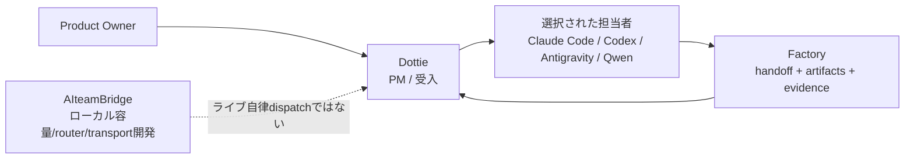

# Multi-AI Workflow Architecture

[English](README.md) | [Japanese](README.ja.md)

ChatGPT, Codex, Claude Code, Gemini/Antigravity, Qwenを使った調査、実装、レビュー、文書作成、マルチモーダル作業の進め方を、公開可能な範囲でまとめます。モデル名は本人の運用上の表記であり、API IDや実行時モデルの確認を意味しません。

## Current Snapshot - 2026-10-05

- 人がProduct Ownerです。**Dottie**はタスク仕様、provider／環境選択、進捗、受入を担うPMです。**Chappy**はアーキテクト／レビュアー、**Claude Code**は通常の実装・デプロイ担当、**Gemini/Antigravity**はPoCやモックの候補、**Qwen**はローカル文章処理とマルチモーダル調査に使います。
- Windowsを常時稼働のローカル基地かつ第一選択とします。Windowsで進められない場合、Macへ切り替える前にユーザーへ相談します。
- タスク難度、必要品質、利用可能な環境、新鮮なquota観測、消費ペース／リセット時間、費用を考慮して選択します。AntigravityからClaudeへ固定的に優先する経路はありません。タスク単位の明示指定は尊重しますが、全体の固定defaultにはしません。
- Claude Codeは通常Sonnet 5.5、難しい作業ではOpus 5.5を使います。Claude CodeとAntigravity内Claudeのquota poolは別です。
- Codexは必要に応じて **Luna / Low → Luna / Medium → Luna / High → GPT-6.1 Sol / Low → Medium → High** の順で上げます。ExtraHighは使いません。Astraは個別に必要性を判断した高度な学術・技術検討に限り、通常のコーディングtierにはしません。これらは本人の運用表記であり、CLIのmodel IDや実行可能性を断定しません。
- CodexBarのquota画像は手動で確認します。quota自動取得と完全自動routingは未検証です。欠落・古い観測は`unknown`として扱い、現在値のようにroutingへ使いません。

[現行の運用判断](docs/operating-decisions-2026-10-05.ja.md)と[Routing Guide](docs/routing-guide.ja.md)を参照してください。

## 役割とワークフローの境界

| 層 | 責任 | 状態 |
|---|---|---|
| Dottie | PM: タスク範囲、provider／環境選択、進捗、受入 | 人が判断するPM役割。完全自律dispatchとは表現しない |
| AI Engineering Factory | 再利用できる簡潔なhandoff、成果物、evidenceの層 | Factory PR #29でminimal-handoffを検証済み。第二の自律orchestratorではない |
| AIteamBridge | 容量観測、routing、transportの実装プロジェクト | ローカル／offline段階。ライブquota取得と自律dispatchは未検証 |

各層は補完的であり、重複する完全自動の司令塔3つとして扱いません。Factoryの検証済みminimal handoffは[PR #29](https://github.com/moruku36/ai-engineering-factory/pull/29)（`4fb014a`でmerge）を参照してください。Bridgeの詳細はリポジトリで変わるため、公開文書では日付付きの検証状況と一般的な境界に絞ります。



## Quotaを考慮した選択

- Sessionとweeklyのquota windowは別の計測値として扱います。使用量／残量にはwindowと観測時刻を付けます。
- 5時間利用がなかったことだけではquotaが100%に戻ったとは言えません。古い・欠落した・鮮度のない観測値は`unknown`とし、手動判断に戻します。
- Antigravity Gemini、Antigravity Claude/GPT、native Claude/Codex subscriptionは別々のpoolです。API料金はsubscription quotaとは別です。残高、quota画像、認証情報、個別アカウントの支出は公開しません。
- 難度、品質、環境制約、観測の鮮度、消費ペース、リセット時刻、費用を総合します。固定閾値だけでは決めません。

## 実装と検証の状態

英語・日本語とも **verified/merged**、**local/offline**、**runtime pending**、**proposal** を区別します。ユーザー承認、実行環境での権限承認、ローカルテスト成功、稼働環境への反映は別の段階です。承認が拒否されたら再試行を連打したり別経路で迂回せず、作業を保存して正規の承認経路で止まります。

- Factoryのminimal-handoffはPR #29で検証済みです。Ubuntu/Windows品質ゲートと、offlineのcontainer-boundary検証を含みます。ライブ自動化を意味しません。
- AIteamBridgeのcapacity/router作業はlocal/offlineで246 testsと報告されています。未commit／未publishであり、ライブの自律quota取得／dispatchは未検証です。この日付付き根拠を更新する際は対象repoを再確認してください。
- 監督付きAntigravity Webセッション1件でタスク依頼と応答を確認し、取得した結果にはunit check 324件とmock browser check 25件が報告されていました。この単一結果はCLI稼働、一般的な自動routing、テストの独立再実行を証明しません。
- CodexBar quota画像の確認は手動です。自動読み取りやquota対応routing全体の自動化を主張しません。

## QwenとオンデマンドGPUの状態

- WindowsのOpen WebUI/Ollama経由の文章応答は本人操作で確認済みです。MacではOpen WebUI 0.11.4とローカルQwen2.5 3Bでローカル応答とWeb検索結果を確認しました。自動orchestrationを意味しません。
- 固定Q8のColabチャットnotebookは元のマルチモーダル構成を保ちます。Qwen Multimodal Colab [PR #35](https://github.com/moruku36/qwen-multimodal-colab/pull/35)はCPU CI 287件（2件skip）を報告しています。Colab/GPU inferenceとモデルdownloadは実行されていません。A100での品質・速度・VRAM・計算使用量は延期中です。
- RunPod運用PR #1は文書のみです。最新チャット候補はLinux CPU検証済みですが、CUDA、モデルdownload、inferenceは未検証です。
- 目標設計はWebUI → OpenAI-compatible API → オンデマンドRunPod Qwenです。OpenAI-compatibleはAPI形式の互換性を示し、有料OpenAI利用を意味しません。Pod起動、HTTP接続、自動終了は検証済みとなるまで目標設計です。
- Podの停止と破棄は別です。停止後も永続storageに料金がかかる場合があり、削除ではデータを失うことがあります。一般的な説明にとどめ、正確な金額や残高は公開しません。

## プライバシーとセキュリティ

このリポジトリは公開です。私的な会話、個人・家族事情、認証情報、ログイン先、quota画像、正確な口座・アカウント残高、これらを含むログは記載しません。一般化した運用制約だけを説明します。文書更新のための新サービス導入、課金、APIキー生成、アプリ実行構成変更、セキュリティ制御の迂回は行いません。

## リポジトリ構成

- `README.md` / `README.ja.md`: 英語・日本語の概要
- `docs/operating-decisions-2026-10-05.md` / `.ja.md`: 日付付き状態、根拠、公開境界
- `docs/routing-guide.md` / `docs/routing-guide.ja.md`: ツール選択と段階的な引き上げ
- `docs/ai-team.md`: チームの役割
- `docs/dots-codexbar-orchestration.md`: PMと観測の境界
- `docs/handoff-templates.md`: 再利用handoff
- `configs/`: ツール別ガイダンス

## クイックスタート

```bash
cp templates/.env.example .env
```

直接クライアントを使う通常の作業では環境テンプレートは任意です。公開文書へ認証情報を記載しないでください。
