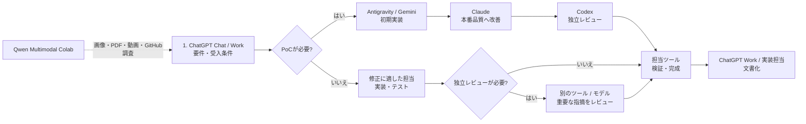

# Multi-AI Workflow Architecture

[English](README.md) | [日本語](README.ja.md)

調査、思考、初期実装、本実装、独立レビュー、マルチモーダル実験を、ChatGPT、Codex、Claude Code、Gemini・Antigravity、Qwen Colabで分担する運用ガイドです。

---

# Multi-AI Workflow Architecture

複数のAIを「1つの万能モデル」として使うのではなく、**思考・初期実装・本実装・独立レビュー・マルチモーダル実験**に役割分担させるための運用リポジトリです。

対象はプログラミングだけではありません。技術調査、文章・資料作成、設計、レビュー、画像・PDF・動画の理解や生成までを、ChatGPT / Codex / Claude Code / Gemini + Antigravity / Qwen Multimodal Colab で使い分けます。

> **Operating snapshot: 2026-10-02（モデル名は所有者申告）**
>
> - ChatGPT Chat / Work: 自分の運用では GPT-6 Luna を標準とし、より深い推論が必要なときだけ GPT-6 Sol へ上げる
> - Codexの文章作成・コーディング: GPT-6 Luna / Lowから開始し、必要な場合だけLuna Medium → Luna High → GPT-6.1 Sol / Mediumへ順に上げる。段階ごとに理由を説明し、テストと必要な独立レビューを維持。Astraは通常コーディングでは温存。蒸留・Factoryの初期調査・論文解釈は明示的に許可され、Solで十分ならSolを使う
> - Claude Code: Sonnet 5.5を標準にする（現在のMedium effortはユーザー申告）。Opus 5.5は難しい仕事に限る
> - 新規モック / PoC / 大量の初期コード: Antigravity経由のGemini 3.8 Flashで開始し、Claudeで本番品質に仕上げ、Codexが独立レビューする。初期実装を再利用し、重複してゼロから作らせない
> - Google Antigravity: 既存方針はGemini 3.8 Flashを通常Highで使う。現在の所有者の希望はMediumであり、この差異を明記してタスクごとに指定する。利用枠が少ない場合は、リセット時刻と作業の難度を見てMediumを優先する。残量50%未満は目安であり、token消費量の削減を保証しない
> - Qwen: Colabが使えない間はローカルQwen 14Bを優先する。ローカル14BとQwen Multimodal Colabは別環境であり、Ollamaがバックエンドであること、ローカル14Bのマルチモーダル機能、自動呼び出しを仮定しない
> - 利用枠: 既存の残量帯を使い、残量30%未満ではその提供元を温存し、枯渇・利用不可時は別の提供元へ振り替える。AntigravityのGemini用枠およびClaude/GPT用枠は、Claude/Codexの個別アカウントの枠とは分ける。各アカウントの利用期間、リセット日時、追加クレジット、有効期限を個別に扱い、残量を合算しない
>
> モデル更新が速いため、**製品名より役割を固定し、モデルは差し替え可能にする**のが基本方針です。利用可能なモデル・利用枠は契約と画面で確認します。
>
> READMEでは、更新負担の大きい静的なアーキテクチャ画像は表示せず、テキストとMermaidで構成を管理します。

---

## 1. AIチームと呼び方

この構成では、ユーザーをProduct Owner、**ドッティ（Dottie）をPM / AIオーケストレーター**として扱います。実装・調査・レビューを担当するAIは「エンジニアチーム」です。

| 呼び方 | 実体 | チーム内の役割 |
|---|---|---|
| **ドッティ** | OpenAI Dots | PM / オーケストレーター。仕事の分解、担当選定、利用枠管理、進捗・レビュー調整 |
| **チャッピー** | ChatGPT + Codex | アーキテクト / 独立レビュアー。要件・設計・調査・文章・明示的に割り当てたCodex作業 |
| **クロード** | Claude Code | Sonnet 5.5を標準とするコーディング・デプロイ担当 / レビュアー。Opus 5.5は難しい仕事に限定 |
| **ジェミナイ** | Gemini 3.8 Flash + Antigravity | 新規モック / PoC / 大量初期実装。Claudeの本番品質への改善へ引き継ぐ |
| **クエン** | ローカルQwen 14B / Qwen Multimodal Colab | Colabが使えない間はローカル14B。Colab利用時は別環境でマルチモーダル調査 |

今回の証跡・モデル比較・Factory方針は日英の [2026-10-02運用決定](docs/operating-decisions-2026-10-02.ja.md) を参照してください。2026-10-02時点の報告では、Windows wrapper（task7）は試作実装・オフライン14テスト成功まで完了し、wrapper経由の実接続は未検証です。Antigravity wrapperは呼び出し単位のツール範囲制御の対応検証待ちで保留中であり、製品一般の制限ではありません。CLIテスト成功だけではクラウド送信や自動統合を証明しません。既存の難問向けAstra利用は従来の許可範囲で個別判断し、通常のCodex昇格とは分離します。

詳細は [AI Team: Names, Roles, and Operating Model](docs/ai-team.md) を参照してください。

### Dottieの実行環境

- **Dottie's cloud computer**: 常時稼働するPM本体
- **Windowsデスクトップ**: 常時起動のローカル基地。ローカル接続後はCodexBarやCLI状態への橋として優先
- **MacBook Air**: Windowsで作業を進められない場合のみ使う副端末。切り替える前に、所有者が端末を操作できる時間を確認して調整する
- ローカルPCがオフラインでも、Dottie自身はクラウド側で継続して動ける構成を目指す

---

## 2. 現在の役割分担

| 役割 | 主担当 | 主な用途 |
|---|---|---|
| **相談・短い下書き** | ChatGPT Chat | 要件の壁打ち、選択肢の整理、短い回答 |
| **非コード成果物** | ChatGPT Work | 出典付き調査、文書・資料・レポートの作成と確認 |
| **新規モック / PoC / 大量初期コード** | Gemini 3.8 Flash + Antigravity → Claude → Codex | 初期実装 → 本番品質への改善 → 独立レビュー。同じ初期実装を再利用 |
| **コーディング・デプロイの標準担当** | Claude Code / Sonnet 5.5 | デプロイは適用される承認後。Chappyが設計・独立レビュー |
| **Codexへ割り当てた実装・文章作成** | Codex + GPT-6 Luna (Lowから) | 必要な場合はLuna Medium → Luna High → GPT-6.1 Sol Medium。理由を説明し、テスト・レビューを維持 |
| **Claudeの標準** | Claude Code + Sonnet 5.5 | 現在のMedium effortはユーザー申告。Opus 5.5は難しい仕事のみ |
| **Codex通常作業の昇格** | GPT-6.1 Sol (Medium)まで | Astraは通常昇格の外で温存。既存の難問利用は個別判断し、蒸留・Factory調査は上記例外 |
| **個人用マルチモーダル環境** | [Qwen Multimodal Colab](https://github.com/moruku36/qwen-multimodal-colab) | Chat / Vision、画像生成・編集、PDF・短い動画の読解、音声入力、GitHubのRead-only調査 |

---

## 3. 基本開発フロー

新規プロジェクトや大きめの機能追加では、仕様と受入条件を決め、必要な工程だけ各ツールに依頼します。既存コードの修正はPoCを挟まず実装担当へ渡せます。



### 原則

1. **PoCは不確実性があるときに挟む**
   - UI案や技術選定を試す。既存コードの明確な修正では省略する。
2. **同じ担当が実装と検証を完了できるようにする**
   - 設計との整合、テスト、差分確認まで依頼する。ツールを渡すだけで品質が上がるとはみなさない。
3. **重要な変更は独立レビューを検討する**
   - 実装担当と異なるツールを使い、根拠と再現手順を求める。指摘は実装担当が検証する。
4. **CodexはLuna Lowから段階的に上げる**
   - 文章作成・コード作業はLow開始。必要ならLuna Medium → Luna High → GPT-6.1 Sol Medium。エスカレーションの理由を説明し、テストと適切なレビューを続ける。
5. **Astraの用途を限定する**
   - 通常コーディングでは温存。蒸留・Factoryの初期調査・論文解釈は明示許可の例外で、Solで十分ならSolを使う。
6. **DottieはCodexBarを利用量の観測レイヤーとして使う（接続検証中）**
   - CodexBarのCLI/Hookから利用率・リセット時刻・provider statusだけを正規化し、DottieがCodex / Claude Code / Antigravity / Qwen Colabをquota-awareに振り分ける。認証トークンやCookieはDotsへ渡さない。詳細は [Dots + CodexBar Orchestration Plan](docs/dots-codexbar-orchestration.md)。

---

## 4. タスク別の使い分け

| タスク | 第一候補 | 第二候補 |
|---|---|---|
| アイデア整理・要件定義 | ChatGPT Chat / Work | Claude（別の視点が必要な場合） |
| 技術調査・比較・レポート | ChatGPT Work | ChatGPT Chat（短い比較） |
| 文章・資料作成 | ChatGPT Work | ChatGPT Chat（短い下書き） |
| PoC / モック / 新規プロジェクトの土台・大量初期コード | Gemini + Antigravity → Claude → Codex | 初期実装を再利用。重複実装を依頼しない |
| 大量の定型修正 | タスクに適した実装担当 | 既存方針はHigh、現在の希望はMedium。タスク指定と実行時の観測値を分ける |
| 通常のコーディング・デプロイ | Claude Code / Sonnet 5.5 | Chappyが設計・独立レビュー。デプロイは適用される承認後 |
| Codexへ割り当てたコード修正・機能実装・文章作成 | GPT-6 Luna (Lowから) | 必要な場合だけLuna Medium → Luna High → GPT-6.1 Sol Medium |
| 難しい機能実装・デバッグ | Codexを段階的に昇格 / Claude Opus 5.5 | Opusは難しい仕事のみ |
| 大規模migration / 長時間の自律作業 | Claude Code / Sonnet 5.5 | 特に難しい仕事はOpus 5.5 |
| 独立コードレビュー | 実装者と別のモデル | Codex / Luna Lowから、またはClaude / Sonnet 5.5 |
| 最終的な難問 | Solで不足する根拠を確認 | 既存の許可範囲でAstraを個別判断。自動昇格しない。蒸留・Factory調査は上記例外 |
| 画像理解・画像生成/編集・PDF/短動画・音声入力 | Qwen Multimodal Colab（利用可能な場合） | ローカルQwen 14Bとは別環境 |
| Colabが使えない間のローカルテキスト作業 | ローカルQwen 14B | Ollamaがバックエンドであること、14Bのマルチモーダル機能、自動呼び出しを仮定しない |
| GitHubリポジトリの読み取り専用調査 | ローカルQwen 14B（テキスト）/ Colab（利用可能な場合） | ChatGPT / Codex |

詳細は [Routing Guide](docs/routing-guide.md) を参照してください。

---

## 4.5 Execution Security（実行セキュリティ）

Task Routing が「**誰に任せるか**」を決めるのに対し、その下に置く任意のレイヤー Execution Security は「**何を許可するか**」を決めます。[OpenShell Claude Reviewer](https://github.com/moruku36/openshell-claude-reviewer) は、Claude Codeレビュアーを NVIDIA OpenShell のサンドボックス内で実行します。OpenShellはモデル階層ではなく、ルーティングやモデル選択は変えません。

| 役割 | 担当 | 権限 |
|---|---|---|
| Builder | Codex | 実装。repoへの書き込み、PR作成が可能 |
| Reviewer | Claude Code（必要に応じてOpenShell内） | repo READのみ。GitHub WRITE（push、PR/Issue書き込み）はDENY |

- 重要repo / セキュリティ重視のレビューだけ OpenShell Claude Reviewer を使う。
- 通常の軽いレビューは従来の Claude Code のまま。全てのClaude Code実行にOpenShellを必須とはしない。
- Reviewerの「pushしない」はプロンプトではなくポリシーで強制する。

> **検証状況**: 境界の deny チェックは 13/13 で検証済み。本物のAnthropic APIキーで実際にAnthropicへ接続する `review.sh` によるレビューは**まだ未確認**。詳細は [Routing Guide](docs/routing-guide.md#7-execution-security) を参照。

---

## 5. 利用枠を守るためのルール

### Codexの利用枠を温存する

- **文章作成・コーディングは GPT-6 Luna / Lowから開始**。必要な場合だけLuna Medium → Luna High → GPT-6.1 Sol / Mediumへ順に昇格し、段階ごとの理由を明示する。テストと適切なレビューを維持する。
- GPT-6 Astraは通常コーディングの段階として使わない。蒸留・Factoryの初期調査・論文解釈は例外として許可済み。
- 新規モック / PoC / 大量初期コードはAntigravity + Gemini 3.8 Flashで開始し、Claudeで本番品質へ改善してからCodexが独立レビューする。

### Claude Codeの利用枠を温存する

- **デフォルトは Sonnet 5.5**（現在のMedium effortはユーザー申告）。
- Opus 5.5は難しい仕事に限る。
- Codexで既に実装済みなら、Claude側は「重大な問題だけレビュー」とスコープを絞る。

### Effortの標準

| モデル | 標準 | 上げる条件 |
|---|---|---|
| GPT-6 Luna | **Lowから開始** | 必要な場合だけMedium → High、続いてGPT-6.1 Sol / Medium。理由を説明しテストとレビューを維持 |
| Claude Sonnet 5.5 | **標準**（Medium effortはユーザー申告） | Opus 5.5は難しい仕事のみ |
| Gemini 3.8 Flash | **既存方針High / 現在の希望Medium** | 残量が少ない場合はリセット時刻と作業難度を考慮してMediumを優先。残量50%未満は目安で、token消費量の削減を保証しない |

### 同じ仕事を二重発注しない

同じ機能の初期実装を複数モデルへゼロから重複発注しません。PoC系ではGeminiの成果をClaudeが改善し、Codexが独立レビューします。既存修正は適性に合わせて担当を選び、ユーザーが指定したAIを優先します。

- Builder: Claude Code → Reviewer: Codex
- Builder: Codex → Reviewer: Claude Code（PoC系以外で適切な場合）

という**クロスレビュー**を基本にします。

---

各アカウントの利用枠、リセット日時、クレジット、有効期限は個別に確認します。AntigravityのGemini用枠とClaude/GPT用枠は、Claude/Codexの個別アカウントの枠と分け、残量を合算しません。残量30%未満はその提供元を温存し、枯渇・利用不可時は別の提供元へ振り替えます。公開リポジトリには、利用枠の状態など必要最小限の情報だけを記録し、非公開のアカウント残量・個人情報・認証情報は記載しません。

### Windows環境のトラブル対応

Windowsを主拠点にし、Windowsで作業を進められない場合だけMacへ切り替えます。切り替える前に、所有者が端末を操作できる時間を確認して調整します。環境トラブルや設定では、Antigravityが利用可能で利用枠に余裕があれば優先し、Dottieが結果を検証します。GUIをインストール済みでも、遠隔操作やCLI認証が可能とは限らないため、実際の機能を確認します。Antigravity CLIを使う場合は、一般利用者向けの公式手段を優先します。セキュリティやネットワーク設定に関わる変更には事前承認が必要で、EDRを迂回しません。

## 6. 非コード作業の基本フロー

文章・資料・調査では、短い相談にChat、完成した成果物の作成にWorkを使います。Codexで文章やコードを書く場合はGPT-6 Luna Lowから開始し、必要な段階だけ上げます。

1. **ChatGPT Chat / Work**: 論点整理、出典確認、構成、初稿
2. **Gemini / Antigravity**: 必要ならファイル化・大量整形・反復作業
3. **Claude Sonnet 5.5**: 重要成果物のみ独立レビュー（難しい仕事に限りOpus 5.5）
4. **ChatGPT Work**: 最終版へ統合し、事実と出典を確認

Qwen Multimodal ColabはGoogle Colab / Google Drive / 外部検索サービスを利用し得るため、**ローカルLLMのような機密データ保護境界としては扱いません**。機密情報は所属組織やサービスの利用ルールに従い、投入可否を個別に判断します。

---

## 7. 実践レシピ集

- [レシピ 01: 議事録・商談メモの高速処理＆リスク検証](docs/cookbook/01-meeting-minutes.md)
- [レシピ 02: 新技術・OSSの選定と比較レポート作成](docs/cookbook/02-tech-selection.md)
- [レシピ 03: 対外発信・プレスリリースの推敲＆リスクチェック](docs/cookbook/03-press-release.md)
- [レシピ 04: コード実装・リファクタリング・独立レビュー](docs/cookbook/04-code-refactor.md)

モデル間の引き継ぎには [Handoff Templates](docs/handoff-templates.md) を使用します。AIチームの呼称・役割は [AI Team](docs/ai-team.md)、Dottieの自動ルーティング案は [Dots + CodexBar Orchestration Plan](docs/dots-codexbar-orchestration.md) を参照してください。

---

## 8. リポジトリ構成

```text
.
├── README.md
├── docs/
│   ├── routing-guide.md
│   ├── handoff-templates.md
│   └── cookbook/
├── configs/
│   ├── qwen-multimodal-colab/     # 現行の個人用Qwenマルチモーダル環境
│   ├── level1-ollama/             # Legacy: 現在は通常運用していない
│   ├── level2-antigravity/
│   ├── level3-chatgpt/
│   └── level4-claude/
├── tools/                        # Legacy補助CLI
│   ├── pipeline.py               # Legacy: Ollama + Claude
│   └── README.md
├── templates/
│   └── .env.example
├── .cursorrules
└── .github/copilot-instructions.md
```

> ディレクトリ名には既存互換のため `level1`〜`level4` を残していますが、現在の運用思想は**階層ではなく役割ベース**です。`level1-ollama` はLegacyで、現在の個人用Qwen環境は別リポジトリの `qwen-multimodal-colab` です。

---

## 9. クイックスタート

### 環境変数

```bash
cp templates/.env.example .env
```

日常の開発フローは、ChatGPT / Antigravity / Codex / Claude Code / Qwen Multimodal Colab を直接利用する運用を前提にしています。`tools/pipeline.py` は旧Ollama構成向けのLegacy補助CLIです。

### 設定

- **Qwen Multimodal Colab**: `configs/qwen-multimodal-colab/` / https://github.com/moruku36/qwen-multimodal-colab
- **Legacy Ollama設定**: `configs/level1-ollama/`（現在は通常運用しない）
- **Gemini + Antigravity**: `configs/level2-antigravity/AGY_RULES.md`
- **ChatGPT**: `configs/level3-chatgpt/custom_instructions.md`
- **Claude**: `configs/level4-claude/review_prompt.md`
- **Execution Security（任意）**: https://github.com/moruku36/openshell-claude-reviewer
- **タスク振り分け**: `docs/routing-guide.md`
- **モデル間の引き継ぎ**: `docs/handoff-templates.md`

---

## 10. 公式情報

モデル名・提供状況は頻繁に変わるため、更新時は公式情報を確認します。

- OpenAI GPT-6 Sol / Luna: https://openai.com/index/introducing-gpt-6-sol-and-luna/
- ChatGPT Work: https://learn.chatgpt.com/docs/get-started-with-work
- OpenAI モデル選択: https://developers.openai.com/api/docs/guides/model-selection
- Anthropic Claude Opus 5.5: https://www.anthropic.com/
- Google Gemini 3.8 Flash: https://ai.google.dev/gemini-api/docs/latest-model
- Google Antigravity agent: https://ai.google.dev/gemini-api/docs/antigravity-agent
- Qwen Multimodal Colab: https://github.com/moruku36/qwen-multimodal-colab
- OpenShell Claude Reviewer: https://github.com/moruku36/openshell-claude-reviewer

---

## 11. ライセンス

本プロジェクトは [MIT License](LICENSE) のもとで公開されています。
