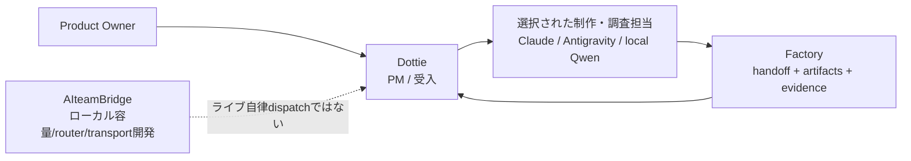

# Multi-AI Workflow Architecture

[English](README.md) | [Japanese](README.ja.md)

ChatGPT, Codex, Claude Code, Gemini/Antigravity, Qwenを使った調査、実装、レビュー、文書作成、マルチモーダル作業の進め方を、公開可能な範囲でまとめます。モデル名は本人の運用上の表記であり、API IDや実行時モデルの確認を意味しません。

## Current Snapshot - 2026-10-10

- 人がProduct Ownerとして最終判断・受入を担います。**Dottie**は短い要件・受入条件・配分・進捗のPM、**Codex / ChatGPT（Chappy）**は複雑な初期設計・難しい判断・必要時の最終エスカレーションを担当します。**Claude Code**と**Gemini/Antigravity**には実装だけでなく調査・文章・翻訳・GitHub文書更新・一次レビューも適性と稼働に応じ配分します。**Qwen local**は許可済み専門調査、**RunPod A100 Qwen**は未受入の将来レビュー候補です。Codexの全文再作成・全面再レビューを標準にしません。
- Windowsを常時稼働のローカル基地かつ第一選択とします。Windowsで進められない場合、Macへ切り替える前にユーザーへ相談します。
- まずClaude / Antigravityの適任かつ余裕ある認可済み候補へ配分します。固定した両者の優先順はなく、適性・残量観測の鮮度・稼働状態・費用を確認します。残量不明は`unknown`、古い観測での手動ローテーションは提案扱いです。異なるproviderのtoken単位を単純合算しません。
- Claude Codeは通常Sonnet 5.5、難しい作業ではOpus 5.5を使います。Claude CodeとAntigravity内Claudeのquota poolは別です。
- 通常のOpenAI選定は **GPT-6 Luna / Medium** または **GPT-6.1 Sol / Medium** の2択です。範囲が明確な作業にはLuna Medium、難度や品質要求が高い作業にはSol Mediumを選び、Low/Medium/Highの6段階運用は行いません。ExtraHighは引き続き使いません。Astraは学術研究や特に難しい上級調査で必要な場合のみ、具体的な理由を示して使う例外です。Sol Mediumで十分ならそれを使います。モデル名は本人の運用上の表記であり、CLI IDやruntimeでの利用可能性を証明しません。
- CodexBarのquota画像は手動で確認します。quota自動取得と完全自動routingは未検証です。欠落・古い観測は`unknown`として扱い、現在値のようにroutingへ使いません。

[現行の運用判断](docs/operating-decisions-2026-10-10.ja.md)と[Routing Guide](docs/routing-guide.ja.md)を参照してください。

## 役割とワークフローの境界

| 層 | 責任 | 状態 |
|---|---|---|
| Dottie | PM: タスク範囲、provider／環境選択、進捗、受入 | 人が判断するPM役割。完全自律dispatchとは表現しない |
| AI Engineering Factory | 再利用できる簡潔なhandoff、成果物、evidenceの層 | Factory PR #29でminimal-handoffを検証済み。第二の自律orchestratorではない |
| AIteamBridge | 容量観測、routing、transportの実装プロジェクト | ローカル／offline段階。ライブquota取得と自律dispatchは未検証 |

各層は補完的であり、重複する完全自動の司令塔3つとして扱いません。Factoryの検証済みminimal handoffは[PR #29](https://github.com/moruku36/ai-engineering-factory/pull/29)（`4fb014a`でmerge）を参照してください。Bridgeの詳細はリポジトリで変わるため、公開文書では日付付きの検証状況と一般的な境界に絞ります。



## Quotaを考慮した選択

- Sessionとweeklyのquota windowは別の計測値として扱います。使用量／残量にはwindowと観測時刻を付けます。
- 5時間利用がなかったことだけではquotaが100%に戻ったとは言えません。古い・欠落した・鮮度のない観測値は`unknown`とし、手動判断に戻します。
- Antigravity Gemini、Antigravity Claude/GPT、native Claude/Codex subscriptionは別々のpoolです。API料金はsubscription quotaとは別です。残高、quota画像、認証情報、個別アカウントの支出は公開しません。
- 難度、品質、環境制約、観測の鮮度、消費ペース、リセット時刻、費用を総合します。固定閾値だけでは決めません。

## 実装と検証の状態

英語・日本語とも **verified/merged**、**local/offline**、**runtime pending**、**proposal** を区別します。ユーザー承認、実行環境での権限承認、ローカルテスト成功、稼働環境への反映は別の段階です。承認が拒否されたら再試行を連打したり別経路で迂回せず、作業を保存して正規の承認経路で止まります。

- Factoryのminimal-handoffはPR #29で検証済みです。Ubuntu/Windows品質ゲートと、offlineのcontainer-boundary検証を含みます。ライブ自動化を意味しません。
- AIteamBridgeのcapacity/router作業はlocal/offlineで246 testsと報告されています。未commit／未publishであり、ライブの自律quota取得／dispatchは未検証です。この日付付き根拠を更新する際は対象repoを再確認してください。
- 監督付きAntigravity Webセッション1件でタスク依頼と応答を確認し、取得した結果にはunit check 324件とmock browser check 25件が報告されていました。この単一結果はCLI稼働、一般的な自動routing、テストの独立再実行を証明しません。
- CodexBar quota画像の確認は手動です。自動読み取りやquota対応routing全体の自動化を主張しません。

## QwenとオンデマンドGPUの状態

- **Local：** Windows Open WebUI/Ollamaの文章応答は本人操作で確認済み。Mac Open WebUI 0.11.4とQwen2.5 3Bにはローカル応答・Web検索結果の過去観測がある。全環境の検索可否・専門調査品質は別途確認が必要で、自動orchestrationの証明ではない。
- **RunPod Phase 1：** [PR #39](https://github.com/moruku36/qwen-multimodal/pull/39)で小型Qwen2.5-1.5B-Instructの実回答1件とPod削除を記録。A100の独立レビュー品質や全ワークフロー受入ではない。
- **RunPod Phase 2：** mock / offlineの範囲のみ。A100によるlive独立レビュー、品質、継続運用は未受入。現時点はClaude / Antigravity相互レビューを使う。会話上の「3.7ぐらい」は未確定な呼称で、モデルIDとして扱わない。
- **Colab：** 固定Q8チャットnotebookは別環境。[PR #35](https://github.com/moruku36/qwen-multimodal-colab/pull/35)のCPU CI 287件（2 skip）はColab/GPU inference・モデルdownload・A100品質の確認ではない。
- OpenAI-compatibleはAPI形式で、有料OpenAI利用を意味しない。単回のHTTP応答を自動起動・接続・終了の完成としない。Pod停止と削除は別で、永続storageやデータ保持にも注意する。この文書改訂ではGPUを起動せず実運用設定を変更しない。

## プライバシーとセキュリティ

このリポジトリは公開です。私的な会話、個人・家族事情、認証情報、ログイン先、quota画像、正確な口座・アカウント残高、これらを含むログは記載しません。一般化した運用制約だけを説明します。文書更新のための新サービス導入、課金、APIキー生成、アプリ実行構成変更、セキュリティ制御の迂回は行いません。

## リポジトリ構成

- `README.md` / `README.ja.md`: 英語・日本語の概要
- `docs/operating-decisions-2026-10-10.md` / `.ja.md`: 最新担当表、業務一覧、配分・失敗時の手順、確認範囲
- `docs/operating-decisions-2026-10-02.md` / `2026-10-05.md` / `2026-10-06.md`: 過去の方針・実験記録を保持
- `docs/routing-guide.md` / `docs/routing-guide.ja.md`: ツール選択と通常OpenAIのMedium 2択
- `docs/ai-team.md`: チームの役割
- `docs/dots-codexbar-orchestration.md`: PMと観測の境界
- `docs/handoff-templates.md`: 再利用handoff
- `configs/`: ツール別ガイダンス
- [`configs/openwebui-local-memory-0.11.4/`](configs/openwebui-local-memory-0.11.4/README.ja.md) ([English](configs/openwebui-local-memory-0.11.4/README.md)): バージョン限定のローカル専用Open WebUI Memory運用手順。読み取り専用のconfig検査ツールとバックアップツール付き。検証はオフラインmockのみで、ライブ挙動は未検証

## クイックスタート

```bash
cp templates/.env.example .env
```

直接クライアントを使う通常の作業では環境テンプレートは任意です。公開文書へ認証情報を記載しないでください。
