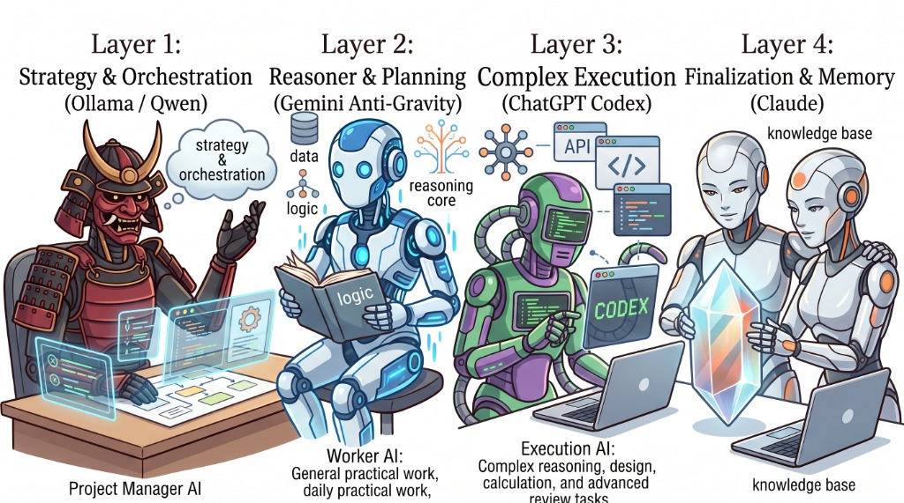

# Multi-AI Workflow Architecture

複数のAIモデル（Ollama/Qwen, Gemini + Antigravity, ChatGPT + Codex, Claude API）それぞれの得意分野を活かし、**「専門チーム」として役割を分担させて生産性を最大化する**ための運用基盤・設定リポジトリです。

エンジニアのプログラミング作業だけでなく、**企画・リサーチ・データ整理・重要書類のレビューなど、あらゆる知的生産業務**に対応しています。

  

---

## 1. 1分でわかる！非エンジニア向け「4人のAIチーム」解説

AIを「1つの万能ツール」として使うと、「回答が浅い」「すぐ利用制限に達する」「機密情報の漏洩が不安」といった壁にぶつかります。  
本構成では、**得意分野の異なる4つのAIを会社のチームのように編成**して協調させます。

`	ext
       【 あなたからの依頼・作業発生 】
                     │
 ┌───────────────────┼───────────────────┐
 ▼                   ▼                   ▼
【Layer 1】          【Layer 2】          【Layer 3】
手元の事務アシスタント   現場のリサーチャー・実務役   専属の戦略参謀・設計パートナー
(Ollama / Qwen)     (Gemini + Antigravity) (ChatGPT + Codex)
 └─ 機密データ成形    └─ 最新情報検索・ツール実行  └─ 深い思考・相談・企画設計
                     │                   │
                     └─────────┬─────────┘
                               │ (重要成果物のレビュー)
                               ▼
                          【Layer 4】
                     外部の冷静な監査役・チェッカー
                             (Claude)
                               └─ 批判的検証・盲点指摘
`

### 👥 4つのAIチームメンバー紹介

| 階層 | 担当AI | チームでの役割（たとえ） | 得意な仕事 | 選定の理由・強み |
|---|---|---|---|---|
| **Layer 1** | **Ollama / Qwen** *(+ Open WebUI)* | **手元の頼れる事務員** | 要約、分類、データ変換、定型フォーマット整形、ログ抽出 | **完全ローカル（自分のPC内）で動く**ため、社外秘データや個人情報が外に出ない。通信費・API代も完全無料。 |
| **Layer 2** | **Gemini + Antigravity** | **足軽リサーチャー＆現場実務役** | 最新情報のWeb検索、資料の下書き作成、ファイル操作、PC上での実作業代行 | **Google検索との連携が強力**でフットワークが軽い。エージェントツールと連動して実際にファイルを編集・作成できる。 |
| **Layer 3** | **ChatGPT + Codex** | **自分専属の知恵袋・チーフ参謀** | 複雑な企画の壁打ち、抽象的な設計、難問の思考、価値観や過去の文脈を踏まえた相談 | **過去の対話やあなたの好み・文脈を一番深く理解できる**。難度の高い思考や本質的なディスカッションに最も強い。 |
| **Layer 4** | **Claude API** | **辛口な外部監査役・顧問** | 成果物の最終チェック、論理の穴やリスクの洗い出し、他AIの回答に対するセカンドオピニオン | **バイアスのない客観的・批判的な視点（あえて粗探しをする能力）**が極めて高い。仲間内の馴れ合いを防ぐ。 |

---

## 2. 具体的なお仕事シナリオ（非エンジニアの活用例）

「新規サービスの企画書を作成し、経営陣に提出する」場合の業務フロー例です。

`	ext
ステップ 1:【相談・企画の骨子決め】（Layer 3: ChatGPT）
   「新しい顧客向けサービスのアイデアを壁打ちしたい。自社の強みと私の過去の担当領域を踏まえて議論しよう」
   👉 専属参謀と一緒に、企画のコンセプトや全体構成を固める。
       ▼
ステップ 2:【市場調査と下書き作成】（Layer 2: Gemini + Antigravity）
   「ChatGPTで決めた骨子をもとに、競合3社の最新料金プランをWebで調べて比較表を作り、企画書のドラフトを作成して」
   👉 現場リサーチャーがネットの最新動向を調査し、実際のファイルを自動作成する。
       ▼
ステップ 3:【大量データの整理】（Layer 1: Ollama / Qwen）
   「社内のアンケート生データ（CSV）から、不満点の要約と数値だけを抜き出してJSON/Markdownにして」
   👉 機密データを外部クラウドに送信せず、手元のPC内で高速・安全・コストゼロで整形する。
       ▼
ステップ 4:【最終チェック・落とし穴の洗い出し】（Layer 4: Claude）
   「完成した企画書を批判的にレビューして。競合からの反撃リスクや、コスト計算に甘い点はないか？」
   👉 外部の監査役が忖度なしで厳しいフィードバックを行い、手戻りを防ぐ。
`

---

## 3. Gemini と ChatGPT の賢い使い分け（外と内）

本ワークフローにおいて、日常的に最も迷いやすい「Gemini」と「ChatGPT」の境界線です。

- **🔷 Gemini（外の世界・手足を動かす）**
  - 今日のニュースや最新の公式ドキュメントをGoogle検索で調べる
  - パソコン内のファイルを実際に読み書き・実行する（Antigravity連携）
  - まずはスピード重視でプロトタイプ（たたき台）を大量に出す
- **🔶 ChatGPT（自分の内面・頭脳を使う）**
  - あなたの過去の経緯、好み、価値観、会社の文脈を踏まえて相談に乗る
  - 複雑なアーキテクチャや「そもそもどう進めるべきか」という方針を深く考える
  - Geminiが作ったドラフトを読み込み、より洗練されたものに昇華させる

> **💡 ヒント: ChatGPTの利用枠（回数制限）を使い切ったときは？**  
> 思考や相談などのディスカッションは引き続き ChatGPT 本体で行い、実際のファイルの修正や作業代行は Gemini（Antigravity）に任せることで、作業を止めることなく効率的に進められます。

---

## 4. リポジトリ構成

`	ext
.
├── README.md                      # 本ドキュメント（全体像と運用思想・非エンジニア向け解説）
├── .gitignore                     # Git管理除外設定
├── assets/
│   └── architecture.jpg           # アーキテクチャ概念図
├── docs/
│   ├── routing-guide.md           # 逆引きタスク振り分けガイド（迷った時の担当決め表）
│   └── handoff-templates.md       # モデル間のコンテキスト引き継ぎ雛形（コピペ用プロンプト）
├── configs/
│   ├── level1-ollama/             # Layer 1 (Qwen + Open WebUI) のModelfile・起動スクリプト
│   ├── level2-antigravity/        # Layer 2 (Gemini) のエージェント行動ルール
│   ├── level3-chatgpt/            # Layer 3 (ChatGPT) のカスタム指示・ペルソナ定義
│   └── level4-claude/             # Layer 4 (Claude API) のレビュープロンプト＆CLI
└── templates/
    └── .env.example               # 環境変数テンプレート
`

---

## 5. クイックスタート

### 1. 環境変数の設定
`ash
cp templates/.env.example .env
# .env を開いて各種APIキー（Claude / Gemini等）を設定
`

### 2. 各階層のセットアップ
- **Layer 1**: configs/level1-ollama/ を参照。Ollamaでローカルモデル（qwen-processor）を作成し、Open WebUIの直感的なブラウザ画面から利用。
- **Layer 2**: configs/level2-antigravity/ のルールを Antigravity のプロンプト・設定に反映。
- **Layer 3**: configs/level3-chatgpt/custom_instructions.md の内容を ChatGPT の「カスタム指示（Custom Instructions）」にコピー。
- **Layer 4**: configs/level4-claude/ のスクリプトを使用し、重要成果物をClaudeでワンタッチレビュー。
