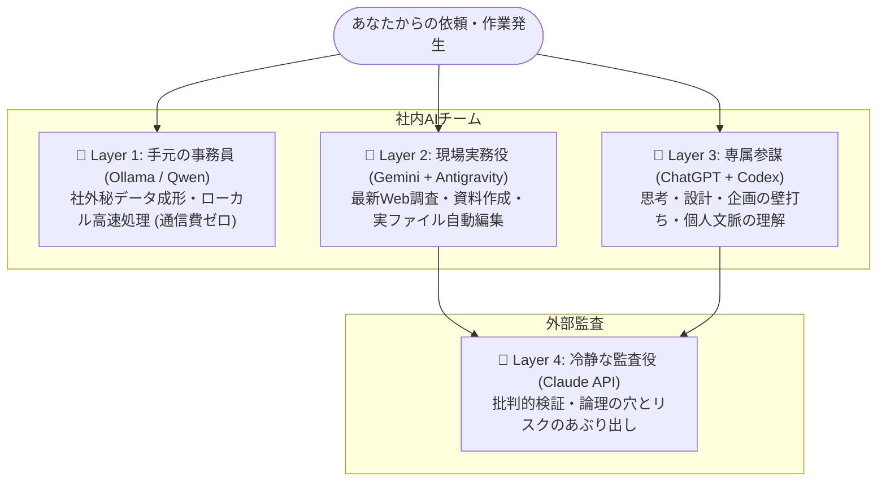

# Multi-AI Workflow Architecture

複数のAIモデル（Ollama/Qwen, Gemini + Antigravity, ChatGPT + Codex, Claude API）それぞれの得意分野を活かし、**「専門チーム」として役割を分担させて生産性を最大化する**ための運用基盤・設定リポジトリです。

プログラミング開発だけでなく、**企画・リサーチ・データ整理・重要書類のレビューなど、あらゆる知的生産業務**に対応しています。

<p align="center">
  
</p>

---

## 1. 1分でわかる！4人のAIチーム編成

AIを「1つの万能ツール」として使うと、「回答が浅い」「すぐ利用制限にかかる」「機密情報の漏洩が不安」といった壁にぶつかります。  
本構成では、**得意分野の異なる4つのAIを社内チームのように編成**して協調させます。



### 👥 各メンバーの役割と強み

#### 🔹 Layer 1: 手元の頼れる事務アシスタント
- **担当AI**: Ollama / Qwen (+ Open WebUI)
- **得意な仕事**: 要約、データ分類、フォーマット変換、ログ抽出
- **強み**: **自分のPC内だけで動く**ため、社外秘や個人情報が外部に出ない。通信費・API代ゼロで大量処理が可能。

#### 🔹 Layer 2: 現場のリサーチャー＆実務担当
- **担当AI**: Gemini + Antigravity
- **得意な仕事**: 最新情報のWeb検索、資料の下書き作成、ファイル作成・編集
- **強み**: **Google検索連携**で最新トレンドの調査に強い。エージェント機能により、PC上のファイル編集などの実作業を自動代行。

#### 🔹 Layer 3: 専属の戦略参謀・チーフパートナー
- **担当AI**: ChatGPT + Codex
- **得意な仕事**: 企画の壁打ち、抽象的な設計、難問の思考、個人の文脈を踏まえた相談
- **強み**: **過去の対話やあなたの好みを一番深く理解できる**。難しい思考や本質的なディスカッションに最適。

#### 🔹 Layer 4: 冷静な外部監査役・最終チェッカー
- **担当AI**: Claude API
- **得意な仕事**: 成果物の最終チェック、論理の穴やリスクの洗い出し、セカンドオピニオン
- **強み**: **バイアスのない客観的・批判的な視点（あえて粗探しをする能力）**が高い。仲間内の馴れ合いを防ぐ。

---

## 2. 具体的なお仕事の流れ（例：新規企画書の作成）

「新規サービスの企画書を作成し、経営陣に提出する」場合の連携フローです。

1. **【企画の骨子決め・壁打ち】（Layer 3: ChatGPT）**
   - *「自社の強みと私の過去の担当領域を踏まえて、新サービスのコンセプトを壁打ちしよう」*
   - 👉 **専属参謀**と一緒に、企画の全体構成や方向性を固める。

2. **【市場調査・ドラフト作成】（Layer 2: Gemini + Antigravity）**
   - *「ChatGPTで決めた骨子をもとに、競合3社の最新料金プランをWebで調査し、企画書のたたき台ファイルを作って」*
   - 👉 **現場リサーチャー**がネットから最新動向を収集し、実際のファイルを作成する。

3. **【社内アンケートの整理】（Layer 1: Ollama / Qwen）**
   - *「アンケートの生データ（CSV）から、不満点の要約と数値だけを抜き出して箇条書きに整形して」*
   - 👉 **事務員**が手元のPC内で、機密データを外部に出さず安全かつコストゼロで加工する。

4. **【最終チェック・リスク洗い出し】（Layer 4: Claude）**
   - *「完成した企画書を批判的にレビューして。競合の反撃リスクやコスト計算に甘い点はないか？」*
   - 👉 **外部監査役**が厳しい視点で穴を突き、役員提出前の手戻りを防止する。

---

## 3. Gemini と ChatGPT の賢い使い分け（外と内）

日常的に最も迷いやすい「Gemini」と「ChatGPT」の境界線です。

| 対象 | 🔷 Gemini（外の世界・手足を動かす） | 🔶 ChatGPT（自分の内面・頭脳を使う） |
|---|---|---|
| **主な用途** | Web検索、最新情報収集、ファイル編集 | 企画の壁打ち、抽象的な設計、方針決定 |
| **得意分野** | スピード重視の調査・下書き作成 | あなたの過去の文脈・価値観を踏まえた思考 |
| **役割** | 現場作業員・高速プロトタイパー | 専属アーキテクト・思考パートナー |

> **💡 ヒント: ChatGPTの利用枠（回数制限）を使い切ったときは？**  
> 思考や方針決めは引き続き ChatGPT 本体で行い、実際のファイル作成や修正作業は Gemini（Antigravity）に任せることで、作業を止めることなく効率的に進められます。

---

## 4. 📚 実践レシピ集 (Cookbook)

様々な業務シナリオに合わせた、コピペして使える実践プロンプト集です。

- **[レシピ 01: 議事録・商談メモの高速処理＆リスク検証](docs/cookbook/01-meeting-minutes.md)**
- **[レシピ 02: 新技術・OSSの選定と比較レポート作成](docs/cookbook/02-tech-selection.md)**
- **[レシピ 03: 対外発信・プレスリリースの推敲＆炎上リスクチェック](docs/cookbook/03-press-release.md)**
- **[レシピ 04: レガシーコードのリファクタリング＆セキュリティ監査](docs/cookbook/04-code-refactor.md)**

---

## 5. リポジトリ構成

```text
.
├── README.md                      # 本ドキュメント（全体像と運用思想・非エンジニア向け解説）
├── LICENSE                        # MIT ライセンス
├── .gitignore                     # Git管理除外設定
├── .cursorrules                   # Cursor / Windsurf / エージェント用ルール設定
├── assets/
│   └── architecture.jpg           # アーキテクチャ概念図
├── docs/
│   ├── routing-guide.md           # 逆引きタスク振り分けガイド（迷った時の担当決め表）
│   ├── handoff-templates.md       # モデル間のコンテキスト引き継ぎ雛形（コピペ用プロンプト）
│   └── cookbook/                  # 実践レシピ集（議事録、選定、広報、リファクタ）
├── configs/
│   ├── level1-ollama/             # Layer 1 (Qwen + Open WebUI) の設定・起動スクリプト (Win/Mac/Linux)
│   ├── level2-antigravity/        # Layer 2 (Gemini) のエージェント行動ルール
│   ├── level3-chatgpt/            # Layer 3 (ChatGPT) のカスタム指示・ペルソナ定義
│   └── level4-claude/             # Layer 4 (Claude API) のレビュープロンプト＆CLI
├── tools/
│   ├── pipeline.py                # Layer 1 と Layer 4 を直結するCLIツール
│   └── README.md                  # ツールの利用ガイド
└── templates/
    └── .env.example               # 環境変数テンプレート
```

---

## 6. クイックスタート

### 1. 環境変数の設定
```bash
cp templates/.env.example .env
# .env を開いて各種APIキー（Claude / Gemini等）を設定
```

### 2. 各階層のセットアップ
- **Layer 1**: `configs/level1-ollama/` を参照。Ollamaでローカルモデル（`qwen-processor`）を作成し、Open WebUIのブラウザ画面から手軽に利用。
- **Layer 2**: `configs/level2-antigravity/` のルールを Antigravity や `.cursorrules` に反映。
- **Layer 3**: `configs/level3-chatgpt/custom_instructions.md` の内容を ChatGPT の「カスタム指示（Custom Instructions）」にコピー。
- **Layer 4**: `configs/level4-claude/` のスクリプトや `tools/pipeline.py` を使用し、重要成果物をClaudeでワンタッチレビュー。

---

## 7. ライセンス
本プロジェクトは [MIT License](LICENSE) のもとで公開されています。