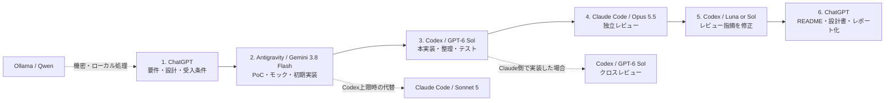

# Multi-AI Workflow Architecture

複数のAIを「1つの万能モデル」として使うのではなく、**思考・初期実装・本実装・独立レビュー・ローカル処理**に役割分担させるための運用リポジトリです。

対象はプログラミングだけではありません。技術調査、文章・資料作成、設計、レビュー、定型処理までを、ChatGPT / Codex / Claude Code / Gemini + Antigravity / Ollama で使い分けます。

> **Model snapshot: 2026-09-23**
>
> - ChatGPT: GPT-5.6 Sol を対話・設計・文章作成の主軸に使用
> - Codex: GPT-6 Sol を主力実装、GPT-6 Luna を軽量・高速実装、GPT-6 Astra を最終エスカレーションに使用
> - Claude Code: Claude Opus 5.5 を難しい実装・独立レビュー、Claude Sonnet 5 を通常実装・代替実装に使用
> - Google Antigravity: Gemini 3.8 Flash をPoC、モック、初期実装、大量の反復作業に使用
> - Ollama / Qwen: 外部へ出したくないデータのローカル加工に使用
>
> モデル更新が速いため、**製品名より役割を固定し、モデルは差し替え可能にする**のが基本方針です。\n>\n> READMEでは、更新負担の大きい静的なアーキテクチャ画像は表示せず、テキストとMermaidで構成を管理します。

---

## 1. 現在の役割分担

| 役割 | 主担当 | 主な用途 |
|---|---|---|
| **司令塔 / 思考パートナー** | ChatGPT | 要件整理、設計、調査、文章・資料作成、実装指示の作成 |
| **高速プロトタイパー / 物量担当** | Gemini 3.8 Flash + Antigravity | PoC、モック、初期実装、UI試作、大量ファイル編集、テストのたたき台 |
| **主力実装** | Codex + GPT-6 Sol | 本実装、難しいデバッグ、リファクタリング、設計を伴うコード変更 |
| **軽量実装** | Codex + GPT-6 Luna | 小規模修正、テスト追加、README修正、定型変更、レビュー指摘の反映 |
| **独立レビュー / 長期作業** | Claude Code + Opus 5.5 | コードベース横断レビュー、難バグ、大規模migration、セキュリティ・設計レビュー |
| **通常のClaude実装** | Claude Code + Sonnet 5 | Codex枠を温存したい通常実装、代替実装、並行検証 |
| **最終エスカレーション** | GPT-6 Astra | Sol / Opus 5.5でも解けない高難度問題 |
| **ローカル機密処理** | Ollama / Qwen | ログ整形、要約、分類、外部送信したくないデータ加工 |

---

## 2. 基本開発フロー

新規プロジェクトや大きめの機能追加では、最初から高価・希少なモデルに全工程を任せません。



### 原則

1. **最初の70〜80%をGemini 3.8 Flashで作る**
   - モック、PoC、ディレクトリ作成、初期テスト、README草案など、試行錯誤が多い工程を担当。
2. **本番品質への仕上げをCodex GPT-6 Solで行う**
   - 設計との整合、複数ファイル変更、難しいデバッグ、テスト品質を詰める。
3. **別系列モデルで独立レビューする**
   - Codexで実装したらClaude Code Opus 5.5、Claude Codeで実装したらCodex GPT-6 Solを優先。
4. **修正は必要以上に上位モデルへ戻さない**
   - typo、Markdown、単純なレビュー指摘はGPT-6 LunaまたはGemini 3.8 Flashへ戻す。
5. **Astraは最後まで温存する**
   - GPT-6 Sol / Opus 5.5で解けない問題、非常に重要な最終判断のみ。

---

## 3. タスク別の使い分け

| タスク | 第一候補 | 第二候補 |
|---|---|---|
| アイデア整理・要件定義 | ChatGPT | Claude Opus 5.5 |
| 技術調査・比較・レポート | ChatGPT | Claude Opus 5.5 |
| 文章・資料作成 | ChatGPT | Claude Opus 5.5 |
| PoC / モック / 新規プロジェクトの土台 | Gemini 3.8 Flash | Claude Sonnet 5 |
| 大量の定型修正 | Gemini 3.8 Flash | GPT-6 Luna |
| 小さなコード修正 | GPT-6 Luna | Gemini 3.8 Flash |
| 通常の機能実装 | GPT-6 Sol | Claude Sonnet 5 |
| 難しい機能実装・デバッグ | GPT-6 Sol | Claude Opus 5.5 |
| 大規模migration / 長時間の自律作業 | Claude Opus 5.5 | GPT-6 Sol |
| 独立コードレビュー | Claude Opus 5.5 | GPT-6 Sol |
| 最終的な難問 | GPT-6 Astra | Claude Opus 5.5 |
| 機密データの整形 | Ollama / Qwen | - |

詳細は [Routing Guide](docs/routing-guide.md) を参照してください。

---

## 4. 利用枠を守るためのルール

### Codexの利用枠を温存する

- 初期モックや探索的実装は Antigravity + Gemini 3.8 Flash。
- Codexでは **Luna → Sol → Astra** の順にエスカレーション。
- Lunaで十分な作業をSol/Astraへ投げない。
- Solで2回程度試して解決しない場合に、Opus 5.5またはAstraへ切り替える。

### Claude Codeの利用枠を温存する

- 通常実装はSonnet 5でも十分なケースが多い。
- Opus 5.5は、難しい実装・長時間作業・独立レビューを中心に使う。
- Codexで既に実装済みなら、Claude側は「重大な問題だけレビュー」とスコープを絞る。

### 同じ仕事を二重発注しない

CodexとClaude Codeの両方に、同じ機能をゼロから実装させるのは原則避けます。

- Builder: Codex → Reviewer: Claude Code
- Builder: Claude Code → Reviewer: Codex

という**クロスレビュー**を基本にします。

---

## 5. 非コード作業の基本フロー

文章・資料・調査では、ChatGPTを中心にします。

1. **ChatGPT**: 論点整理、構成、調査、初稿
2. **Gemini / Antigravity**: 必要ならファイル化・大量整形・反復作業
3. **Claude Opus 5.5**: 重要成果物のみ独立レビュー
4. **ChatGPT**: 最終版へ統合

ローカルの機密データを含む場合は、前処理をOllama / Qwenで行います。

---

## 6. 実践レシピ集

- [レシピ 01: 議事録・商談メモの高速処理＆リスク検証](docs/cookbook/01-meeting-minutes.md)
- [レシピ 02: 新技術・OSSの選定と比較レポート作成](docs/cookbook/02-tech-selection.md)
- [レシピ 03: 対外発信・プレスリリースの推敲＆リスクチェック](docs/cookbook/03-press-release.md)
- [レシピ 04: コード実装・リファクタリング・独立レビュー](docs/cookbook/04-code-refactor.md)

モデル間の引き継ぎには [Handoff Templates](docs/handoff-templates.md) を使用します。

---

## 7. リポジトリ構成

```text
.
├── README.md
├── docs/
│   ├── routing-guide.md
│   ├── handoff-templates.md
│   └── cookbook/
├── configs/
│   ├── level1-ollama/
│   ├── level2-antigravity/
│   ├── level3-chatgpt/
│   └── level4-claude/
├── tools/
│   ├── pipeline.py
│   └── README.md
├── templates/
│   └── .env.example
├── .cursorrules
└── .github/copilot-instructions.md
```

> ディレクトリ名には既存互換のため `level1`〜`level4` を残していますが、現在の運用思想は**階層ではなく役割ベース**です。

---

## 8. クイックスタート

### 環境変数

```bash
cp templates/.env.example .env
```

APIキーを使うCLIは補助ツールです。日常の開発フローは、ChatGPT / Antigravity / Codex / Claude Codeの各クライアントを直接利用する運用を前提にしています。

### 設定

- **Ollama / Qwen**: `configs/level1-ollama/`
- **Gemini + Antigravity**: `configs/level2-antigravity/AGY_RULES.md`
- **ChatGPT**: `configs/level3-chatgpt/custom_instructions.md`
- **Claude**: `configs/level4-claude/review_prompt.md`
- **タスク振り分け**: `docs/routing-guide.md`
- **モデル間の引き継ぎ**: `docs/handoff-templates.md`

---

## 9. 公式情報

モデル名・提供状況は頻繁に変わるため、更新時は公式情報を確認します。

- OpenAI GPT-6 Sol / Luna: https://openai.com/index/introducing-gpt-6-sol-and-luna/
- Anthropic Claude Opus 5.5: https://www.anthropic.com/claude-opus-5-5
- Google Gemini 3.8 Flash: https://ai.google.dev/gemini-api/docs/latest-model
- Google Antigravity agent: https://ai.google.dev/gemini-api/docs/antigravity-agent

---

## 10. ライセンス

本プロジェクトは [MIT License](LICENSE) のもとで公開されています。
