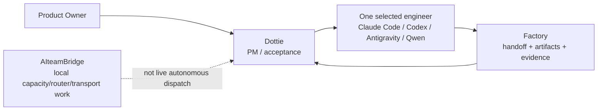

# Multi-AI Workflow Architecture

[English](README.md) | [日本語](README.ja.md)

Public, evidence-aware guidance for coordinating research, implementation, review, writing, and multimodal work across ChatGPT, Codex, Claude Code, Gemini/Antigravity, and Qwen. Model names below are owner-reported operating labels, not claims about API IDs or runtime identity.

## Current operating snapshot — 2026-10-05

- The human is Product Owner. **Dottie** handles PM work: task specification, environment/provider selection, progress, and acceptance. **Chappy** handles architecture and review. **Claude Code** is the usual coding/deployment engineer; **Gemini/Antigravity** is an option for PoCs and mocks; **Qwen** supports local text and multimodal research.
- Windows is the always-on local base, with Mac as a secondary helper.
- Choose the tool and model by task difficulty, required quality, eligible environment, fresh quota observations, consumption pace/reset window, and cost. Do not use a fixed Antigravity-Claude-first route. Honor an explicit task-level choice without turning it into a global default.
- Claude Code usually uses Sonnet 5.5; use Opus 5.5 for harder work. Its quota is separate from Claude inside Antigravity.
- Codex escalation is **Luna / Low → Luna / Medium → Luna / High → GPT-6.1 Sol / Low → Medium → High** when needed. Do not use ExtraHigh. Astra is reserved for individually justified advanced academic/technical analysis; it is not a routine coding tier. These labels describe the owner's usage and do not assert a CLI model ID or runtime availability.
- CodexBar quota images are checked manually. Automated quota retrieval and fully automatic routing are not verified. Treat missing or stale observations as unknown and do not route on them as if current.

See the [current operating decisions](docs/operating-decisions-2026-10-05.md) and [routing guide](docs/routing-guide.md).

## Roles and workflow boundaries

| Layer | Responsibility | Status |
|---|---|---|
| Dottie | PM: task scope, provider/environment selection, progress and acceptance | Human-directed PM role; do not imply complete autonomous dispatch |
| AI Engineering Factory | Reusable minimal handoff, artifacts, and evidence layer | Minimal handoff verified in Factory PR #29; it is not a second autonomous orchestrator |
| AIteamBridge | Capacity observations, routing, and transport implementation project | Local/offline stage; live quota retrieval and autonomous dispatch unverified |

These layers complement one another; they are not three overlapping, fully automated command centers. For Factory's verified minimal handoff, see [PR #29](https://github.com/moruku36/ai-engineering-factory/pull/29) (merged at `4fb014a`). Bridge details can change with its repository, so keep public claims limited to dated verification and generic boundaries.


```mermaid
flowchart LR
    U["Product Owner"] --> D["Dottie<br/>PM / acceptance"]
    D --> A["One selected engineer<br/>Claude Code / Codex / Antigravity / Qwen"]
    A --> F["Factory<br/>handoff + artifacts + evidence"]
    F --> D
    B["AIteamBridge<br/>local capacity/router/transport work"] -. "not live autonomous dispatch" .-> D
```

## Quota-aware selection

- Treat session and weekly quota windows as different measurements. Used/remaining values must name their window and observation time.
- No activity for five hours does not establish a 100% quota reset. Keep old, missing, or stale observations `unknown` and fail closed to a manual choice.
- Antigravity Gemini, Antigravity Claude/GPT, and native Claude/Codex subscriptions are separate pools. API charges are not subscription quota. Never publish balances, quota screenshots, credentials, or account-specific spending.
- Weigh complexity, quality, environment constraints, freshness, consumption rate, reset timing, and cost. Fixed thresholds alone are insufficient.

## Implementation and verification status

Keep **verified/merged**, **local/offline**, **runtime pending**, and **proposal** distinct in English and Japanese. A user approval, execution-environment authorization, a passing local test, and a production/runtime change are separate stages. Do not repeatedly retry rejected approvals or use another route to bypass them; preserve the work and stop for the correct approval path.

- The Factory minimal-handoff direction is verified by PR #29 and includes Ubuntu/Windows quality gates and an offline, container-boundary verification. This does not establish live automation.
- AIteamBridge capacity/router work has been reported at 246 local/offline tests; it is uncommitted/unpublished, and live autonomous quota retrieval/dispatch is unverified. Recheck the source repository before changing this dated evidence.
- A user-provided Antigravity Web Remote Control session showed a desktop connection, Gemini 3.8 Flash High selection, and a read-only DateMemory request displayed as Working. This confirms web-route request acceptance only; implementation, tests, completion, and automation remain unverified. The local Windows CLI is separate and remains unverified after access denied.
- CodexBar quota-image review is manual. No claim of automatic reading or complete quota-aware routing.

## Qwen and on-demand GPU status

- Windows text through Open WebUI/Ollama has received a user-operated response check. On Mac, Open WebUI 0.11.4 with a small local Qwen2.5 3B has returned local responses and web-search results; this is not automated orchestration.
- The separate fixed-Q8 Colab chat notebook preserves the original multimodal setup. Qwen Multimodal Colab PR #35 reports 287 CPU CI tests and a successful GPU inference run; do not conflate those results or present CPU CI as GPU inference.
- The RunPod operations PR #1 is documentation-only. The latest chat candidate has Linux CPU validation; CUDA, model download, and inference remain unverified.
- The proposed flow is WebUI → OpenAI-compatible API → on-demand RunPod Qwen. OpenAI-compatible describes an API shape and does not mean paid OpenAI. Starting a Pod, connecting over HTTP, and automatic termination remain design goals until verified.
- Stopping a Pod and destroying it are different. Persistent storage may continue to incur charges after a Pod stops, while deletion may lose data. Keep this general and do not publish account balances or exact costs.

## Privacy and security

This is a public repository. Do not include private conversations, personal or family details, credentials, login destinations, quota images, exact account balances, or logs containing them. Describe only general operating constraints. Do not add services, incur charges, generate API keys, change application execution configuration, or bypass security controls as part of documentation work.

## Repository map

- `README.md` / `README.ja.md`: English and Japanese overview
- `docs/operating-decisions-2026-10-05.md`: dated status, evidence, and privacy boundaries in both languages
- `docs/routing-guide.md`: tool selection and escalation guidance
- `docs/ai-team.md`: team roles
- `docs/dots-codexbar-orchestration.md`: PM/observation boundaries
- `docs/handoff-templates.md`: reusable handoffs
- `configs/`: tool-specific guidance

## Quick start

```bash
cp templates/.env.example .env
```

The environment template is optional for the direct client workflow; do not put credentials in public documentation.
