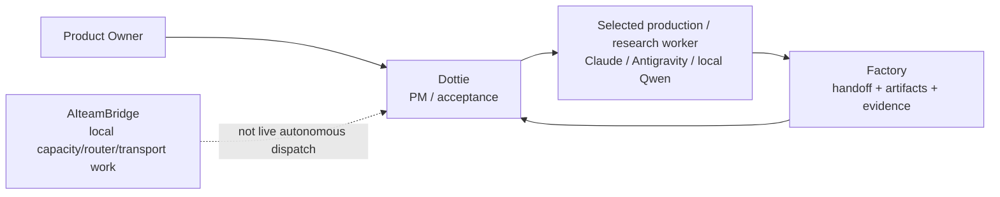

# Multi-AI Workflow Architecture

[English](README.md) | [日本語](README.ja.md)

Public, evidence-aware guidance for coordinating research, implementation, review, writing, and multimodal work across ChatGPT, Codex, Claude Code, Gemini/Antigravity, and Qwen. Model names below are owner-reported operating labels, not claims about API IDs or runtime identity.

## Current operating snapshot — 2026-10-10

- The human owns final decisions and acceptance. **Dottie** handles short requirements, acceptance criteria, allocation and progress. **Codex / ChatGPT (Chappy)** handles complex initial design, difficult decisions and final escalation when needed. **Claude Code** and **Gemini/Antigravity** share research, writing, translation, GitHub docs and first review as well as implementation by fit and availability. **Local Qwen** supports authorized specialist research; **RunPod A100 Qwen** is an unaccepted future review candidate. Full-text Codex rewrites and comprehensive re-review are not the default.
- Windows is the always-on local base and first choice. If work cannot proceed there, consult the user before switching to Mac; Mac is a helper environment.
- First allocate to fitting, available authorized Claude / Antigravity candidates. Neither has a fixed priority: consider fit, capacity freshness, actual availability and cost. Missing capacity is `unknown`; manual rotation under stale observations is a proposal. Do not sum unlike provider token units.
- Claude Code usually uses Sonnet 5.5; use Opus 5.5 for harder work. Its quota is separate from Claude inside Antigravity.
- Routine OpenAI selection uses only **GPT-6 Luna / Medium** or **GPT-6.1 Sol / Medium**. Choose Luna Medium for bounded work and Sol Medium when complexity or the quality bar warrants it; there is no Low/Medium/High six-step ladder. ExtraHigh remains outside the policy. Astra is an exception only when academic research or particularly difficult advanced investigation needs it, with a concrete reason; use Sol Medium when sufficient. These are owner-reported labels, not CLI IDs or proof of runtime availability.
- CodexBar quota images are checked manually. Automated quota retrieval and fully automatic routing are not verified. Treat missing or stale observations as unknown and do not route on them as if current.

See the [current operating decisions](docs/operating-decisions-2026-10-10.md) and [routing guide](docs/routing-guide.md).

## Roles and workflow boundaries

| Layer | Responsibility | Status |
|---|---|---|
| Dottie | PM: task scope, provider/environment selection, progress and acceptance | Human-directed PM role; do not imply complete autonomous dispatch |
| AI Engineering Factory | Reusable minimal handoff, artifacts, and evidence layer | Minimal handoff verified in Factory PR #29; it is not a second autonomous orchestrator |
| AIteamBridge | Capacity observations, routing, and transport implementation project | Local/offline stage; live quota retrieval and autonomous dispatch unverified |

These layers complement one another; they are not three overlapping, fully automated command centers. For Factory's verified minimal handoff, see [PR #29](https://github.com/moruku36/ai-engineering-factory/pull/29) (merged at `4fb014a`). Bridge details can change with its repository, so keep public claims limited to dated verification and generic boundaries.


```mermaid
flowchart LR
    U["Product Owner"] --> D["Dottie<br/>PM / acceptance"]
    D --> A["Selected production / research worker<br/>Claude / Antigravity / local Qwen"]
    A --> F["Factory<br/>handoff + artifacts + evidence"]
    F --> D
    B["AIteamBridge<br/>local capacity/router/transport work"] -. "not live autonomous dispatch" .-> D
```

## Quota-aware selection

- Treat session and weekly quota windows as different measurements. Used/remaining values must name their window and observation time.
- No activity for five hours does not establish a 100% quota reset. Keep old, missing, or stale observations `unknown` and fail closed to a manual choice.
- Antigravity Gemini, Antigravity Claude/GPT, and native Claude/Codex subscriptions are separate pools. API charges are not subscription quota. Never publish balances, quota screenshots, credentials, or account-specific spending.
- Weigh complexity, quality, environment constraints, freshness, consumption rate, reset timing, and cost. Fixed thresholds alone are insufficient.

## Implementation and verification status

Keep **verified/merged**, **local/offline**, **runtime pending**, and **proposal** distinct in English and Japanese. A user approval, execution-environment authorization, a passing local test, and a production/runtime change are separate stages. Do not repeatedly retry rejected approvals or use another route to bypass them; preserve the work and stop for the correct approval path.

- The Factory minimal-handoff direction is verified by PR #29 and includes Ubuntu/Windows quality gates and an offline, container-boundary verification. This does not establish live automation.
- AIteamBridge capacity/router work has been reported at 246 local/offline tests; it is uncommitted/unpublished, and live autonomous quota retrieval/dispatch is unverified. Recheck the source repository before changing this dated evidence.
- In one supervised Antigravity web session, a task request and response were observed; the retrieved result reported 324 unit checks and 25 mock browser checks. This is a single web-task result, not proof of CLI operation, general automated routing, or independently reproduced tests. Local Windows CLI status remains unverified.
- CodexBar quota-image review is manual. No claim of automatic reading or complete quota-aware routing.

## Qwen and on-demand GPU status

- **Local:** Windows Open WebUI/Ollama text responses were owner-checked. Mac Open WebUI 0.11.4 with Qwen2.5 3B has past observations of local responses and web-search results. Search availability and specialist-research quality require environment-specific checks; this is not automated orchestration.
- **RunPod Phase 1:** [PR #39](https://github.com/moruku36/qwen-multimodal/pull/39) records one real response from small Qwen2.5-1.5B-Instruct and Pod deletion. It does not accept A100 independent-review quality or the complete workflow.
- **RunPod Phase 2:** Mock/offline only. Live A100 independent review, quality and ongoing operation are not accepted. Use Claude / Antigravity mutual review for now. The conversational label “around 3.7” is unresolved and is not a model ID.
- **Colab:** The fixed-Q8 chat notebook is separate. [PR #35](https://github.com/moruku36/qwen-multimodal-colab/pull/35) reports 287 CPU CI checks (2 skipped), not Colab/GPU inference, model-download or A100-quality verification.
- OpenAI-compatible describes an API shape, not paid OpenAI. A single HTTP response does not establish automatic startup, connection and termination. Pod stop and deletion differ, including storage costs and data retention. This documentation change starts no GPU and changes no runtime settings.

## Privacy and security

This is a public repository. Do not include private conversations, personal or family details, credentials, login destinations, quota images, exact account balances, or logs containing them. Describe only general operating constraints. Do not add services, incur charges, generate API keys, change application execution configuration, or bypass security controls as part of documentation work.

## Repository map

- `README.md` / `README.ja.md`: English and Japanese overview
- `docs/operating-decisions-2026-10-10.md` / `.ja.md`: current responsibilities, work list, allocation/failure procedure and evidence limits
- `docs/operating-decisions-2026-10-02.md` / `2026-10-05.md` / `2026-10-06.md`: historical policy and experiment records are retained
- `docs/routing-guide.md`: tool selection and the two routine OpenAI Medium choices
- `docs/ai-team.md`: team roles
- `docs/dots-codexbar-orchestration.md`: PM/observation boundaries
- `docs/handoff-templates.md`: reusable handoffs
- `configs/`: tool-specific guidance
- [`configs/openwebui-local-memory-0.11.4/`](configs/openwebui-local-memory-0.11.4/README.md) ([日本語](configs/openwebui-local-memory-0.11.4/README.ja.md)): version-scoped, local-only Open WebUI Memory runbook with a read-only config inspector and backup tool; offline mock checks only, live behavior unverified

## Quick start

```bash
cp templates/.env.example .env
```

The environment template is optional for the direct client workflow; do not put credentials in public documentation.
