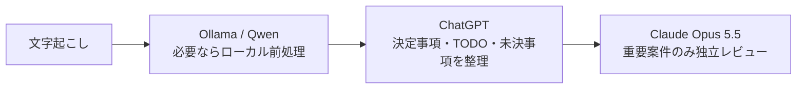

# レシピ 01: 議事録・商談メモの高速処理＆リスク検証

機密性を保ちながら、会議メモを短時間で意思決定・TODO・リスクへ変換するレシピです。

---

## ワークフロー



機密性が問題にならない場合は、Ollamaを省略してChatGPTから開始できます。

---

## Step 1: Ollama / Qwen（必要な場合のみ）

```text
以下の会議文字起こしから、個人情報・機密識別子を必要に応じて伏せたうえで、
「決定事項」「未決事項」「TODO」に必要な情報だけを残してください。
挨拶、相槌、言い淀みは削除してください。
```

## Step 2: ChatGPT

```text
以下の会議メモを整理してください。

出力:
1. 決定事項
2. 未決事項
3. TODO（担当・期限が分かれば併記）
4. 次回までに確認すべき論点

事実と推測を分け、メモにない担当者や期日は作らないでください。
```

## Step 3: Claude Opus 5.5（重要案件のみ）

```text
以下の決定事項とTODOを独立レビューしてください。

確認観点:
- 合意が曖昧な項目
- 担当・期限・依存関係の抜け
- 実行不能になりそうな前提
- 重要な認識齟齬

重大な問題だけを優先し、問題がなければ無理に指摘を作らないでください。
```
