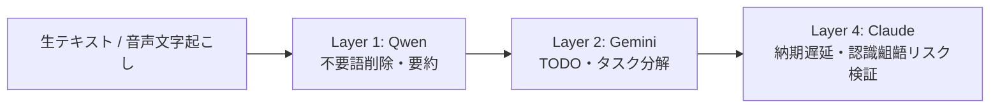

# レシピ 01: 議事録・商談メモの高速処理＆リスク検証

社内会議や商談の文字起こしテキストから、**「社外秘を守りつつ、TODOを自動化し、見落としたリスクを浮き彫りにする」** ための連携レシピです。

---

## 1. ワークフロー概要



---

## 2. ステップ別プロンプト

### Step 1: 【Layer 1 (Qwen / ローカル)】不要な雑音除去と要点整理
機密情報（取引先名・金額など）が含まれるため、外部に出さず手元PCで処理します。

```text
以下の会議文字起こしから「決定事項」と「未決事項」のみを箇条書きで抽出してください。
挨拶や相槌、言い淀みは完全に除外してください。

--- 入力テキスト ---
[文字起こしデータを貼り付け]
```

### Step 2: 【Layer 2 (Gemini + Antigravity)】アクションアイテムの作成
Layer 1で整理されたメモから、具体的なタスク一覧とスケジュールを作成します。

```text
以下の決定事項・未決事項をもとに、担当者別のTODOリストを作成してください。
各タスクには「期日目安」と「必要な準備」を付記し、Markdownのチェックボックス形式で出力してください。

--- Layer 1の出力 ---
[Layer 1の出力を貼り付け]
```

### Step 3: 【Layer 4 (Claude)】リスク・合意漏れの批判的検証
決定事項に潜む暗黙の前提や、納期破綻のリスクを監査役にチェックさせます。

```text
以下のTODOリストおよび会議決定事項を批判的に検証してください。
1. 期日やリソースに無理がある項目はないか？
2. 会議参加者間で合意が曖昧なまま進められようとしている論点はないか？
3. 次回会議までに発生しうるトラブルを予測して警告してください。

--- Layer 2の出力 ---
[Layer 2のTODOリストを貼り付け]
```