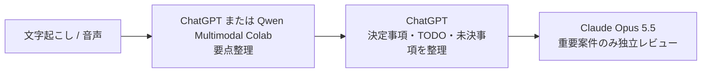

# レシピ 01: 議事録・商談メモの高速処理＆リスク検証

会議メモを短時間で意思決定・TODO・リスクへ変換するレシピです。機密情報を含む場合は、各AIサービスへの投入可否を組織ルールに従って判断します。

---

## ワークフロー


```mermaid
flowchart LR
    A[文字起こし / 音声] --> B[ChatGPT または Qwen Multimodal Colab<br/>要点整理]
    B --> C[ChatGPT<br/>決定事項・TODO・未決事項を整理]
    C --> D[Claude Opus 5.5<br/>重要案件のみ独立レビュー]
```

Qwen Multimodal Colabは音声入力やファイル読解に使えますが、Google Colab等の外部環境で動くため、機密データ用のローカル処理とは扱いません。

---

## Step 1: ChatGPT / Qwen Multimodal Colab

音声やファイルを含む場合はQwen Multimodal Colab、テキストだけならChatGPTを使えます。

```text
以下の会議文字起こしから、
「決定事項」「未決事項」「TODO」に必要な情報だけを残してください。
挨拶、相槌、言い淀みは削除してください。
```

## Step 2: ChatGPT

```text
以下の会議メモを整理してください。

出力:
1. 決定事項
2. 未決事項
3. TODO（担当・期限が分かれば併記）
4. 次回までに確認すべき論点

事実と推測を分け、メモにない担当者や期日は作らないでください。
```

## Step 3: Claude Opus 5.5（重要案件のみ）

```text
以下の決定事項とTODOを独立レビューしてください。

確認観点:
- 合意が曖昧な項目
- 担当・期限・依存関係の抜け
- 実行不能になりそうな前提
- 重要な認識齟齬

重大な問題だけを優先し、問題がなければ無理に指摘を作らないでください。
```
