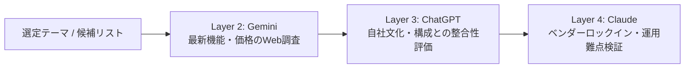

# レシピ 02: 新技術・OSSの選定と比較レポート作成

新しいフレームワークやライブラリ、SaaSツールの選定において、**「最新情報を網羅し、自社方針に照らし合わせ、潜む落とし穴を暴く」** レシピです。

---

## 1. ワークフロー概要



---

## 2. ステップ別プロンプト

### Step 1: 【Layer 2 (Gemini)】最新の公式情報と機能比較表の作成
Google検索を活用し、2026年現在の最新バージョン情報・料金・制約を網羅調査します。

```text
[ツールA] と [ツールB] の最新状況をWeb調査し、以下の観点で比較表を作成してください。
1. ライセンス体系・利用料金
2. 主要機能と対応プラットフォーム
3. GitHubスター数・最近のコミット頻度・コミュニティの活発度
4. 公式ドキュメントの充実度
```

### Step 2: 【Layer 3 (ChatGPT)】自社の文脈に合わせた適合性評価
過去のプロジェクト方針やチームの技術レベルを踏まえ、どちらが自社に最適かを壁打ちします。

```text
Geminiが作成した以下の比較表を見てください。
私たちのチーム規模（約5名、フルスタック志向、保守性最優先）と、過去のインフラ方針を踏まえた場合、
どちらを選択すべきでしょうか？
メリット・デメリットおよび技術的トレードオフを論理的に解説してください。

--- 調査結果 ---
[Layer 2の比較表を貼り付け]
```

### Step 3: 【Layer 4 (Claude)】辛口レビュー（移行コスト・リスクの洗い出し）
「本当に導入して後悔しないか？」を客観的な第三者視点で粗探しさせます。

```text
以下の選定結論について、Devil's Advocate（あえて反対する立場）として反論してください。
- 運用フェーズでどのような隠れコスト（学習コスト、アップデート追従、ロックイン等）が発生するか？
- 本選定を見送るべき決定的な理由となり得るシナリオを提示してください。

--- 採用方針 ---
[Layer 3の結論を貼り付け]
```