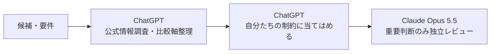

# レシピ 02: 新技術・OSSの選定と比較レポート作成

新しい技術・OSS・SaaSを、最新情報と自分たちの制約の両方から比較するレシピです。

---

## ワークフロー



---

## Step 1: ChatGPTで一次情報を調査

```text
[候補A] と [候補B] を最新の一次情報を中心に比較してください。

観点:
- ライセンス・料金
- 主要機能
- 対応環境
- 運用負荷
- セキュリティ
- 移行性・ロックイン
- 更新頻度・サポート状況

情報には出典と確認日を付けてください。
```

## Step 2: 自分たちの条件へ適用

```text
上記の調査結果を、以下の条件に照らして整理してください。

- チーム構成:
- 既存技術:
- 運用体制:
- セキュリティ要件:
- 予算:
- 移行期限:

「一般的に優れているか」ではなく、この条件でのトレードオフを示してください。
```

## Step 3: Claude Opus 5.5で独立レビュー

```text
以下の技術選定案を独立レビューしてください。

特に、
- 見落とした移行コスト
- ロックイン
- 運用上の隠れコスト
- セキュリティ上の前提
- 将来の撤退難易度

について、根拠のあるMajor以上の懸念だけを挙げてください。
```
