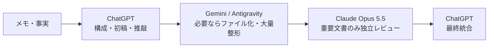

# レシピ 03: 対外発信・重要文書の作成とレビュー

プレスリリース、公式ブログ、重要なお知らせなどを、ChatGPT中心で作成し、必要な場合だけ別モデルで独立レビューするレシピです。

---

## ワークフロー



---

## Step 1: ChatGPTで構成と初稿

```text
以下の事実だけを使って、対外向け文書の構成と初稿を作成してください。

- 読者:
- 伝えたいこと:
- 必ず含める事実:
- 避ける表現:
- 文体:

事実にない数値や「業界初」などの断定は追加しないでください。
```

## Step 2: 必要ならAntigravityでファイル化

大量のMarkdown整形、複数ファイルへの反映、フォーマット変換など、内容判断より作業量が大きい工程を任せます。

## Step 3: Claude Opus 5.5でレビュー

```text
以下の文書を独立レビューしてください。

観点:
- 誤解を生む表現
- 根拠のない断定
- 数値・比較表現の不整合
- 法務・規約上の確認が必要な箇所
- 読者に意図と違う受け取られ方をする重大な箇所

細かな文体の好みではなく、公開判断に影響する問題を優先してください。
```

最終的な文章統合はChatGPTへ戻します。
