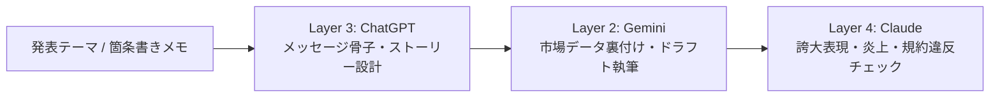

# レシピ 03: 対外発信・プレスリリースの推敲＆炎上リスクチェック

広報発表、公式ブログ記事、重要なお知らせ文書の作成において、**「伝わるメッセージを作り、誤解や炎上の火種を事前に消す」** レシピです。

---

## 1. ワークフロー概要



---

## 2. ステップ別プロンプト

### Step 1: 【Layer 3 (ChatGPT)】コアメッセージと構成の壁打ち
読者に何を一番伝えたいのか、ストーリーラインを構築します。

```text
新機能のリリースに関する広報記事を作成します。
私たちのブランドメッセージ（誠実・シンプル・高信頼）を反映した、読者の共感を呼ぶ記事構成（見出し案と各章の要点）を提案してください。

--- メモ ---
[機能概要・狙い・ターゲット層を箇条書き]
```

### Step 2: 【Layer 2 (Gemini)】裏付け調査と本文ドラフト作成
業界統計や最新トレンドを補足しながら、読みやすい本文を一気に書き上げます。

```text
ChatGPTで作成した以下の構成案に沿って、ブログ記事のドラフトを作成してください。
業界の最新動向や関連キーワードを盛り込み、分かりやすく簡潔な文体で出力してください。

--- 構成案 ---
[Layer 3の構成案を貼り付け]
```

### Step 3: 【Layer 4 (Claude)】冷徹な校正とリスク審査
誇大表現、法的リスク、受け手によって不快感を与える表現を徹底的に炙り出します。

```text
以下のプレスリリース本文を、広報審査員および法務担当者の厳しい視点でチェックしてください。
1. 誇大広告（景品表示法上のリスク、「業界初」「完全」等の安易な使用）はないか？
2. 読者の反感を買う可能性のある表現や、誤解を招く二重表現はないか？
3. 修正すべきセンテンスと、その理由を重要度順に提示してください。

--- ドラフト本文 ---
[Layer 2の本文を貼り付け]
```