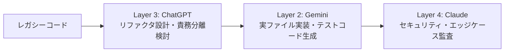

# レシピ 04: レガシーコードのリファクタリング＆セキュリティ監査

保守が難しくなった既存コードを、**「設計方針を整理し、安全に書き換え、脆弱性をゼロにする」** 開発者向け実践レシピです。

---

## 1. ワークフロー概要



---

## 2. ステップ別プロンプト

### Step 1: 【Layer 3 (ChatGPT / Codex)】アーキテクチャの改善検討
コードの構造的課題（密結合・神クラスなど）を特定し、リファクタリング計画を策定します。

```text
以下のレガシーコードについて、SOLID原則に基づいてリファクタリング方針を策定してください。
インターフェースの分離案と、クラス構成の変更前・変更後の対比を提示してください。

--- 対象コード ---
[コードを貼り付け]
```

### Step 2: 【Layer 2 (Gemini + Antigravity)】実コードの適用とユニットテスト生成
Antigravityに指示し、プロジェクト内のファイルへの適用とテストを実行させます。

```text
ChatGPTで決定した以下の設計方針に従い、対象ファイルをリファクタリングしてください。
また、リファクタリング後のコードに対する包括的な単体テスト（正常系・異常系）を新規作成し、テストを実行してパスすることを確認してください。

--- 設計仕様 ---
[Layer 3の仕様を貼り付け]
```

### Step 3: 【Layer 4 (Claude API)】セキュリティ＆境界値監査
書き換えたコードに新たな脆弱性やデッドロックが生じていないかを厳しく検査します。

```text
`configs/level4-claude/review_cli.py` を使用してレビューを実行:

cat path/to/refactored_code.py | python configs/level4-claude/review_cli.py
```