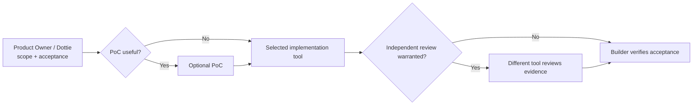

# Cookbook 04: Code Refactoring and Independent Review

[English](04-code-refactor.md) | [日本語](04-code-refactor.ja.md)

Use a direct implementation route for clear changes. Add a PoC only when it reduces meaningful uncertainty. Choose the tool per task using the [routing guide](../routing-guide.md); Claude Code usually uses Sonnet 5.5, with Opus 5.5 for hard work. A different tool may independently review important changes.

## Workflow


```mermaid
flowchart LR
    A["Product Owner / Dottie<br/>scope + acceptance"] --> B{"PoC useful?"}
    B -->|Yes| C["Optional PoC"]
    B -->|No| D["Selected implementation tool"]
    C --> D
    D --> E{"Independent review warranted?"}
    E -->|Yes| F["Different tool reviews evidence"]
    E -->|No| G["Builder verifies acceptance"]
    F --> G
```

## Define the change

```text
Goal:
Scope / non-goals:
Constraints / environment:
Acceptance criteria:
Required checks:
Requested tool/model/effort (task-specific, if any):
```

## Implement and verify

Ask the selected tool to inspect the actual files, make the bounded change, run the relevant available checks, and report:

- changed files and behavior
- checks run and results
- unresolved assumptions or runtime-pending work
- any required approval stage

For Codex-assigned coding, the current effort sequence is Luna Low → Luna Medium → Luna High → Sol Low → Sol Medium → Sol High as needed. Do not use ExtraHigh. Astra is reserved for individually justified advanced academic/technical analysis, not routine coding.

## Independent review

Use a tool different from the implementation tool when the change warrants review. Request only actionable findings with severity, file/line, evidence, impact, and reproduction or verification steps. The implementation owner validates findings before applying them.

Keep user approval, execution-environment authorization, local tests, and live runtime/deployment distinct. Preserve work and stop if the required approval is denied; do not retry repeatedly or route around it.
