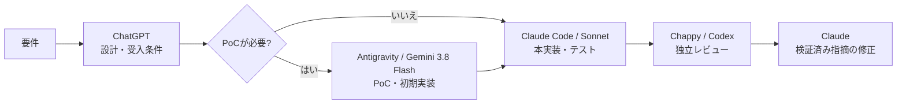

# レシピ 04: コード実装・リファクタリング・独立レビュー

現在の標準開発フローを、そのまま使える形にしたレシピです。DottieがPM、Chappyが設計・独立レビュー、ClaudeがSonnetで実装・承認済みデプロイを担当します。PoCは必要な場合だけ行います。証跡とモデル比較は [2026-10-02運用決定](../operating-decisions-2026-10-02.ja.md) に従います。

---

## ワークフロー


```mermaid
flowchart LR
    A[要件] --> B[ChatGPT<br/>設計・受入条件]
    B --> Q{PoCが必要?}
    Q -->|はい| C[Antigravity / Gemini 3.8 Flash<br/>PoC・初期実装]
    Q -->|いいえ| D
    C --> D[Claude Code / Sonnet<br/>本実装・テスト]
    D --> E[Chappy / Codex<br/>独立レビュー]
    E --> F[Claude<br/>検証済み指摘の修正]
```

---

## Step 1: ChatGPTで設計を確定

```text
以下の変更について、実装前に仕様を整理してください。

出力:
- 目的
- 変更範囲
- 非対象
- アーキテクチャ上の方針
- セキュリティ上の制約
- 受入条件
- 必須テスト
```

## Step 2: Gemini 3.8 Flash / Antigravityで初期実装

```text
以下の確定仕様に従って、まず動く実装を作成してください。
対象ファイルを確認し、実装、テスト追加、test/lint/buildまで実行してください。

過剰設計は避け、仕様外の大きな変更が必要な場合は勝手に進めず論点を残してください。

--- 確定仕様 ---
[ChatGPTの仕様]
```

## Step 3: Claude Code / Sonnetで本番品質へ

```text
Antigravityで作成した初期実装をレビューし、本番品質へ仕上げてください。

- 仕様との乖離
- エラー処理
- 境界値
- テスト品質
- 保守性
- 不要な複雑性

を確認し、必要な修正を行ってtest/lint/buildを実行してください。
```

ClaudeはSonnetを標準とし、Opusは難しい仕事に限ります。同じ初期実装を再利用します。

## Step 4: Chappy / Codexで独立レビュー

```text
この変更を独立レビューしてください。
Critical / Major を優先し、Minor・typo・好みのリファクタリングは原則不要です。

各指摘に:
- 根拠
- 影響
- 最小修正案

を付けてください。問題がなければ無理に指摘を作らないでください。
```

## Step 5: Claudeで修正・検証

Claudeへ根拠付き指摘を返して修正・検証します。デプロイは適用される承認後に行います。

Codexへ明示的に割り当てた文章・コード作業はLuna Lowから必要な場合だけMedium → High → GPT-6.1 Sol Mediumへ上げ、理由を記録します。Astraは通常コーディングでは温存し、蒸留・Factoryの初期調査・論文解釈は明示許可の例外とします。Solで十分ならSolを使います。

レビュー指摘は無条件に採用せず、コード上の根拠を確認してから修正します。
