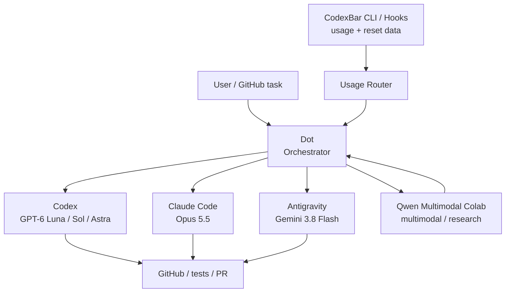

# Dots + CodexBar Orchestration Plan

> Status: **planned**. Enable this workflow after Dots is available on the account and its actual integration surface has been verified.

The goal is to use a Dot as the orchestration layer while preserving the existing model policy. Dots should not blindly choose the strongest model. It should consider task complexity, provider quota, reset time, and the role of each tool.

## Architecture



## CodexBar as the usage source

CodexBar is the preferred quota-observation layer because it can expose usage information for multiple coding providers and can be consumed programmatically.

Use, in priority order:

1. **CodexBar CLI / machine-readable output** for current snapshots.
2. **CodexBar hooks** for quota transitions, usage updates, reset times, and provider failures.
3. GUI display only for human inspection; do not design the Dot around screen-reading the menu bar.

Useful normalized fields for the router:

```json
{
  "provider": "codex",
  "usagePercent": 0.42,
  "window": "weekly",
  "resetAt": "2026-10-01T00:00:00Z",
  "status": "ok"
}
```

The adapter must tolerate missing provider/model windows. Never invent a remaining percentage when CodexBar cannot retrieve one.

## Routing policy

The current model policy remains unchanged:

- **Codex GPT-6 Luna / Medium**: normal default implementation.
- **Codex GPT-6 Sol / Medium**: escalate when Luna is insufficient.
- **GPT-6 Astra**: final escalation only.
- **Claude Code Opus 5.5 / Medium**: difficult implementation, long-running work, independent review.
- **Gemini 3.8 Flash / Antigravity**: PoC, high-volume implementation, repetitive work, and overflow when other quotas should be preserved.
- **Qwen Multimodal Colab**: image/PDF/video/audio work and read-only research; not the primary code-writing agent.

Quota awareness changes **where** a task is sent, not the quality bar or acceptance criteria.

## Initial quota rules

These thresholds are starting defaults, not hard product limits.

| Remaining budget | Behavior |
|---|---|
| ≥ 80% | Follow normal task-based routing |
| 50–80% | Prefer Luna / Flash and other efficient choices for routine work; reserve Sol / Opus for tasks that benefit materially |
| 30–50% | Route routine/high-volume work to Antigravity; preserve Codex/Claude for review and difficult work |
| < 30% | Preserve that provider by default; use it only when the task materially benefits from it or an alternate cannot safely complete it |
| exhausted / unavailable | Route to an eligible alternate and record the reason |

Also consider **time until reset**. A low remaining percentage that resets soon can be used more aggressively than the same percentage with several days remaining.

## Selection algorithm

1. Classify the task: research, writing, PoC, routine implementation, difficult implementation, review, or multimodal.
2. Build an eligible-provider set based on capability and security constraints.
3. Read the latest CodexBar usage snapshot.
4. Remove exhausted/unavailable providers.
5. Penalize providers with low remaining quota and distant reset times.
6. Choose the cheapest/most abundant model that meets the quality requirement.
7. Run the task with explicit acceptance criteria.
8. For important changes, send the result to a different provider for independent review.
9. Record provider/model, reason, quota snapshot, result, and test status.

## Dots integration boundary

Do not assume Dots can directly read local CodexBar state or invoke every external coding agent.

When Dots rolls out:

1. Verify whether the Dot can invoke a local/remote bridge, plugin, webhook, or API that can receive CodexBar data.
2. If direct local access is unavailable, expose a **minimal usage bridge** that publishes only normalized quota/status data.
3. Keep provider credentials inside CodexBar/provider CLIs; the Dot should receive usage metadata, not raw tokens/cookies.
4. Use explicit adapters for task execution (Codex, Claude Code, Antigravity, GitHub) rather than UI automation when possible.
5. Treat Qwen Colab as a separate remote runtime; hand off research results back to the orchestrator.

## Safety and privacy

- Never send CodexBar browser cookies, OAuth tokens, CLI credentials, or provider auth files to Dots.
- Only export provider name, quota windows, percentages, reset timestamps, status, and optional non-sensitive model buckets.
- Keep an audit log of routing decisions.
- Require confirmation for destructive repository operations unless the execution environment already provides an equivalent approval gate.
- Fall back to manual routing if usage data is stale or ambiguous.

## Future implementation

A small `usage-router` component should eventually provide:

- `GET /usage`: normalized provider quota snapshot.
- `POST /events/codexbar`: receive CodexBar hook events.
- `POST /route`: return recommended provider/model for a task classification.
- local JSON history for consumption trends and reset-aware routing.
- optional GitHub status/comment output explaining which agent was selected and why.

The first implementation should be read-only with respect to provider accounts. Automatic task execution can be added only after the available Dots integration mechanisms are verified.
