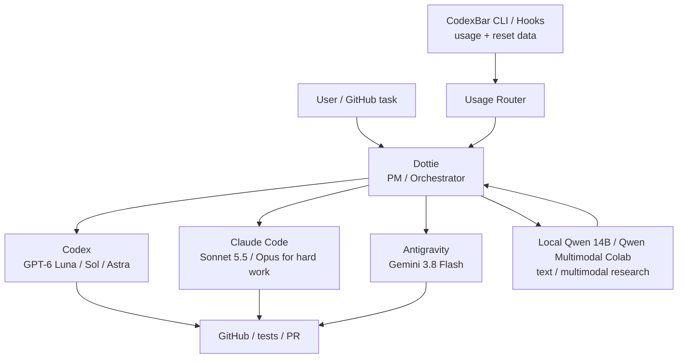

# Dots + CodexBar Orchestration Plan

> Status: **initial rollout / validation**. Dots is now available on the account. The Dot is named **Dottie（ドッティ）**. Validate local-computer access, CodexBar integration, and external-agent execution before enabling fully automatic routing. As reported on 2026-10-02, the Windows wrapper (task7) prototype is implemented with 14 offline tests passed, but live execution through it is untested. The Antigravity wrapper is blocked pending verification of supported per-invocation tool-scope controls; this dated status is not a general product limit. See the [2026-10-02 evidence boundaries](operating-decisions-2026-10-02.md); local no-tool OK tests do not prove cloud-session sends or unattended integration.

The goal is to use **Dottie** as the PM/orchestration layer while preserving the existing model policy. The owner is the Product Owner; Chappy, Claude, Gemini, and Qwen are the engineering team. See [AI Team](ai-team.md). Dots should not blindly choose the strongest model. It should consider task complexity, provider quota, reset time, and the role of each tool.

## Runtime topology

Target setup:

- Dottie's cloud computer is the primary always-on PM runtime.
- The always-on Windows desktop is the preferred local base for CodexBar and local CLI/tool state once local access is enabled.
- Windows is the primary local base. Use the Mac only when Windows cannot proceed; coordinate with the owner in advance when they can operate the devices.
- Dottie should not depend on either local machine being online for cloud-side planning and tracking.

## Architecture



## CodexBar as the usage source

CodexBar is the preferred quota-observation layer because it can expose usage information for multiple coding providers and can be consumed programmatically.

Use, in priority order:

1. **CodexBar CLI / machine-readable output** for current snapshots.
2. **CodexBar hooks** for quota transitions, usage updates, reset times, and provider failures.
3. GUI display only for human inspection; do not design the Dot around screen-reading the menu bar.

Useful normalized fields for the router:

```json
{
  "provider": "codex",
  "usagePercent": 0.42,
  "window": "weekly",
  "resetAt": "2026-10-01T00:00:00Z",
  "status": "ok"
}
```

The adapter must tolerate missing provider/model windows. Never invent a remaining percentage when CodexBar cannot retrieve one.

## Routing policy

Current task routing follows this policy:

- **Codex writing and coding**: start GPT-6 Luna / Low; escalate only as needed through Luna / Medium → Luna / High → GPT-6.1 Sol / Medium. Record the concrete reason, test appropriately, and retain independent review where warranted. GPT-6 Astra is not routine coding; the owner permits initial research/paper interpretation for distillation and Factory, with Sol when sufficient.
- **Claude Code**: default coding/deployment engineer, with Chappy as architect/reviewer. Deployment requires applicable authorization. Sonnet 5.5 is the default (currently Medium effort, owner-reported); escalate to Opus 5.5 only for hard work.
- **New mocks, PoCs, and bulk initial code**: Gemini 3.8 Flash through Antigravity → Claude refinement to production quality → Codex independent review. Reuse the initial implementation; do not commission duplicates.
- **Existing repairs**: route to the best-fit tool; honor the user's explicit AI choice.
- **Windows setup / troubleshooting**: prefer Antigravity when available and quota permits; Dottie verifies outcomes. Security-sensitive or network changes require approval; never bypass EDR.
- **Qwen**: prefer local Qwen 14B while Colab is unavailable. Local 14B and Qwen Multimodal Colab are distinct; do not assume an Ollama backend, local multimodal capabilities, or automated invocation.

Quota awareness changes **where** a task is sent, not the quality bar or acceptance criteria.

## Initial quota rules

These thresholds are starting defaults, not hard product limits.

| Remaining budget | Behavior |
|---|---|
| ≥ 80% | Follow normal task-based routing |
| 50–80% | Prefer Luna / Flash and other efficient choices for routine work; reserve Sol / Opus for tasks that benefit materially |
| 30–50% | Route routine/high-volume work to Antigravity; preserve Codex/Claude for review and difficult work |
| < 30% | Preserve that provider by default; use it only when the task materially benefits from it or an alternate cannot safely complete it |
| exhausted / unavailable | Route to an eligible alternate and record the reason |

Also consider **time until reset**. A low remaining percentage that resets soon can be used more aggressively than the same percentage with several days remaining.

The prior Gemini effort policy is usually High; the owner currently prefers Medium. Preserve this discrepancy and record the request for each task; when its remaining quota is low, prefer Medium after weighing reset time and task difficulty. Below 50% is a guideline, not a promise of fixed token savings. Below 30%, conserve a provider; when exhausted or unavailable, reroute. Consider each account's windows, reset times, credits, and expiry separately. Antigravity's Gemini pool and Claude/GPT pools are separate from native Claude/Codex accounts, and their balances must never be merged.

## Selection algorithm

1. Classify the task: research, writing, PoC, routine implementation, difficult implementation, review, or multimodal.
2. Build an eligible-provider set based on capability and security constraints.
3. Read the latest CodexBar usage snapshot.
4. Remove exhausted/unavailable providers.
5. Penalize providers with low remaining quota and distant reset times.
6. Choose the cheapest/most abundant model that meets the quality requirement.
7. Run the task with explicit acceptance criteria.
8. For important changes, send the result to a different provider for independent review.
9. Record requested model/effort separately from observed runtime model/effort (`UNKNOWN` if unavailable). Track accepted/executed/verified separately; a queue receipt does not prove execution or result read. Retain reason, sanitized quota metadata, artifact manifest, result, and check references. Freeze inputs and rubric before model comparisons.

Use the official consumer route if invoking the Antigravity CLI. Verify the actual capabilities available in the current session: an installed GUI does not establish remote control or CLI authentication.

## Dots integration boundary

Do not assume Dots can directly read local CodexBar state or invoke every external coding agent.

During rollout validation:

1. Verify whether the Dot can invoke a local/remote bridge, plugin, webhook, or API that can receive CodexBar data.
2. If direct local access is unavailable, expose a **minimal usage bridge** that publishes only normalized quota/status data.
3. Keep provider credentials inside CodexBar/provider CLIs; the Dot should receive quota metadata only, not raw tokens, cookies, credentials, or account content.
4. Use explicit adapters for task execution (Codex, Claude Code, Antigravity, GitHub) rather than UI automation when possible.
5. Treat Qwen Colab as a separate remote runtime; hand off research results back to the orchestrator.

## Safety and privacy

- Never send CodexBar browser cookies, OAuth tokens, CLI credentials, or provider auth files to Dots.
- Only export provider name, quota windows, percentages, reset timestamps, status, and optional non-sensitive model buckets. Never put private account balances or personal information in this public repository.
- Keep an audit log of routing decisions.
- Security-sensitive changes, including network configuration, need approval. Never bypass EDR or treat tool access as blanket authority for security changes.
- Require confirmation for destructive repository operations unless the execution environment already provides an equivalent approval gate.
- Fall back to manual routing if usage data is stale or ambiguous.

The Factory minimal manifest/review/reacquire direction is approved for implementation but unproven; use the contract in the [operating decisions](operating-decisions-2026-10-02.md).

## Future implementation

A small `usage-router` component should eventually provide:

- `GET /usage`: normalized provider quota snapshot.
- `POST /events/codexbar`: receive CodexBar hook events.
- `POST /route`: return recommended provider/model for a task classification.
- local JSON history for consumption trends and reset-aware routing.
- optional GitHub status/comment output explaining which agent was selected and why.

The first implementation should be read-only with respect to provider accounts. Automatic task execution should be enabled only after Dottie's local-computer access and external-agent execution paths are verified.
