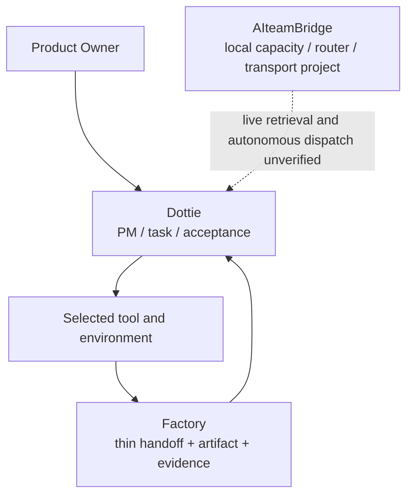

# Dottie, CodexBar, and Handoff Boundaries

[English](dots-codexbar-orchestration.md) | [日本語](dots-codexbar-orchestration.ja.md)

> Status snapshot: 2026-10-05. Manual quota review is in use; live quota ingestion and fully automatic dispatch are unverified.

This document separates PM coordination from capacity tooling and reusable engineering handoffs. Dottie is the PM. Factory provides a minimal handoff/artifact/evidence layer. AIteamBridge is a separate local capacity/router/transport implementation project. They are complementary components, not competing claims of a complete autonomous orchestrator.

## Runtime topology

- Windows is the always-on local base and first choice. Consult the user before switching to Mac if Windows cannot proceed.
- Mac is a helper environment.
- Dottie owns task scope, provider/environment selection, progress, acceptance, and review coordination.
- One selected engineer performs the bounded task; Factory can preserve handoff and evidence for reuse.

## Capacity observation

- CodexBar images are manually inspected. Do not describe automated screenshot reading or a live automatic quota feed as operational.
- Preserve quota window, provider pool, observation timestamp, and freshness in any future normalized record.
- Session and weekly windows are distinct. Five hours without activity does not mean a 100% reset.
- Direct Claude Code, Antigravity Claude/GPT, Antigravity Gemini, and native Codex have distinct pools. API charges are separate from subscription quota.
- Missing, stale, or ambiguous evidence is `unknown`; return to a manual choice.
- Routing depends on task difficulty, quality, environment, fresh capacity evidence, consumption pace/reset, and cost, rather than fixed quota thresholds.

## Current verification boundary

- Factory's minimal handoff is verified in [PR #29](https://github.com/moruku36/ai-engineering-factory/pull/29), merged at `4fb014a`, including Ubuntu/Windows quality gates and offline container-boundary verification.
- Bridge capacity/router work is reported at 246 local/offline tests, uncommitted and unpublished. Live quota retrieval and autonomous dispatch are unverified; recheck that repository before treating the count or state as current.
- One supervised Antigravity web session showed a task request and response; the retrieved result reported 324 unit checks and 25 mock browser checks. This single result does not prove CLI operation, general automatic routing, or independent test reproduction.
- Local Windows CLI received an access-denied response and remains unverified. The web route and local CLI are different routes.
- User approval, execution-environment authorization, local test results, and live environment reflection are separate stages. Preserve work and stop when the proper approval is denied; do not retry in a loop or bypass it via another route.

## Privacy and future work

Never pass provider credentials, cookies, or account content into a router. Do not publish exact balances, cost values, quota screenshots, private conversations, connection identifiers, or logs. Future quota/router work should fail closed on stale/unknown observations and log only sanitized evidence. No automatic execution should be claimed before its exact provider route, authorization, result readback, and acceptance checks are verified.
