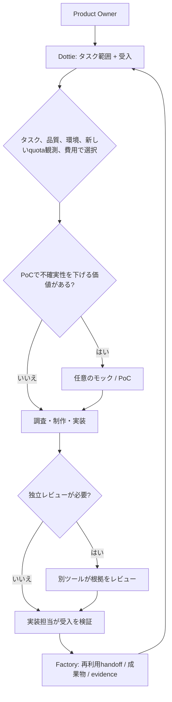

# Routing Guide

[English](routing-guide.md) | [Japanese](routing-guide.ja.md)

Windowsを常時稼働のローカル基地かつ第一選択とします。Windowsで進められない場合は、Macへ切り替える前にユーザーへ相談します。Macは補助環境です。

Task fit、environment、quota evidence、quality、costに沿って利用可能なtoolを選びます。タスクに合わない固定model sequenceは使いません。model labelは本人の運用表記で、API IDや実行時modelの確認ではありません。

## Current Snapshot - 2026-10-10

| 作業 | 主な候補 | 代替・review |
|---|---|---|
| 短い要件・受入・配分・進捗 | Dottieと本人 | 複雑な設計・難しい判断だけCodex / ChatGPT |
| 調査・公式出典・比較・要約・図表用データ | Antigravity | 適したClaude、許可済み資料整理はlocal Qwen |
| 技術文書・ブログ初稿・推敲・翻訳 | Claude | Antigravityの別案・一次review |
| 実装・修正・試験 | ClaudeまたはAntigravity | 可能なら別provider review |
| PoC / mock | AntigravityまたはClaude | 不確実性を下げる場合だけ実施 |
| 一般repo編集・GitHub文書更新・PR整形 | Claude | Antigravity、別担当の差分・リンク確認 |
| 独立一次review | 制作者とは別providerを可能な限り選択 | 現時点はClaude / Antigravity相互review。難しい論点だけCodex |
| 許可済み専門調査 | Windows / Mac local Qwen | 検索・出典能力は環境ごとに確認 |
| 将来の独立review | RunPod A100 Qwen（未受入） | 現時点はClaude / Antigravity |

役割は固定割当ではなく、適性・残量鮮度・稼働で配分します。Codexの全文代行・全面再レビューを標準にしません。

### 通常OpenAIのMedium 2択

通常のOpenAI選定は **GPT-6 Luna / Medium** または **GPT-6.1 Sol / Medium** の2択です。範囲が明確な作業にはLuna Medium、難度や品質要求が高い作業にはSol Mediumを選び、Low/Medium/Highの6段階運用は行いません。ExtraHighは引き続き使いません。Astraは学術研究や特に難しい上級調査で必要な場合のみ、具体的な理由を示して使う例外です。Sol Mediumで十分ならそれを使います。モデル名は本人の運用上の表記であり、CLI IDやruntimeでの利用可能性を証明しません。

指定したworker model/effortと観測されたruntime model/effortを別々に記録します。実際のworker選択を行えない、または確認できない場合は制約を報告し、観測値を`UNKNOWN`とします。選択できたと偽ったり、代替モデルへ黙って切り替えたりしません。

### ClaudeとAntigravity

- Claude Codeは通常Sonnet 5.5です。作業に必要な場合にOpus 5.5を選びます。
- Antigravityはタスクに応じてモデルやpoolを選択できます。全体でAntigravity-Claudeを優先する規則はありません（特定作業でGemini 3.8 Flash Highを指定した選択はその作業に限り、別途指定がない限り全体defaultにしません）。
- 直接のClaude CodeとAntigravity内Claudeは別の容量poolです。

## 配分手順とhandoff失敗

1. タスクごとに目的、完了条件、小さな入力、担当、代替1つ、予定予算／作業上限、成果物／evidenceを記録する。
2. 認可済み経路の利用可否と実際の稼働を確認する。subscriptionとAPI、provider別pool、観測時刻付きsession／weekly残量、reset時刻を分ける。不明・古い値は`unknown`。異なるproviderのtoken単位を単純合算して均等化しない。
3. まずClaude / Antigravityの適任かつ余裕ある候補に配分する。役割表は固定割当ではない。残量が古い場合の手動ローテーションは偏りを避ける提案であり、十分な残量の証明ではない。
4. 受け渡し失敗は1回で原因と保存済み成果を記録する。権限拒否は止め、別経路で迂回しない。通常の稼働不良なら別の認可済み候補1つを検討する。不可なら`blocked`／本人handoff待ちとし、自動的にCodexの全文代行へ戻さない。例外は短い理由を記録する。
5. 可能なら制作・実装者とレビュー担当をprovider別にする。Antigravity内ClaudeとClaude Codeは別poolでも同providerなので独立性を区別する。レビューは指定範囲・根拠・重大な不確実性を扱い、Codexは難しい論点だけを必要時に判断する。

## Quotaと費用の観測

1. Sessionとweeklyの利用枠は別に扱い、各観測にwindowと時刻を記録します。
2. CodexBarの画像確認は手動です。画像の自動読み取り、ライブquota取得、完全自動routingを主張しません。
3. Antigravity GeminiとAntigravity Claude/GPTのpoolは別々で、さらにnative Claude/Codex subscriptionのpoolとも別です。API費用はsubscription quotaとは別です。
4. 5時間利用が見られないことだけでquotaが100%にリセットしたとは言えません。
5. 欠落・古い・曖昧な観測値は`unknown`とし、暗黙にrouteせず明示的／手動選択に戻します。
6. 難度、品質基準、環境適合性、観測の鮮度、消費ペース、リセット時間、費用を総合します。閾値だけのroutingでは不十分です。

quota画像、正確な残高、個別支出、認証情報、非公開セッションの内容を公開文書へ載せません。

## 業務ルーティング例

| 業務 | 配分例 | 根拠と受入 |
|---|---|---|
| 調査・ブログ・文書 | Antigravity調査／公式出典 → Claude初稿・推敲・翻訳 → Antigravity図表用データ → 別provider担当review → 本人承認 → 許可された公開担当 | 出典URL・取得日、初稿revision、図表の数値、指摘と修正。4媒体のブログ下書きも本人レビュー前は公開しない |
| コード・修正・試験 | Dottieの短い仕様 → 必要ならCodex初期設計 → ClaudeまたはAntigravity実装・試験 → 別provider review → 担当が修正・再検証 → 本人受入 | 差分、試験結果、未検証runtime。reviewを全面再実装にしない |
| 一般repo編集・PR整形 | 小さな入力＋編集範囲 → Claude文書編集／PR整形（代替Antigravity） → 別担当の差分・リンク確認 → 許可されたアップロード | 対象branch、変更files、既存変更保持、内容readback。mergeは別途明示された範囲のみ |
| 許可済み専門調査 | Local Qwenで資料整理 → 検索可能な担当が公式出典を確認 → Claude / Antigravityが限定review → 本人判断 | 環境・モデルの観測、許可範囲、出典と不確実性。担当変更で安全機能を回避しない |

## ワークフローの選択

Dottieが仕様化と調整を行い、Factoryが薄い再利用可能なhandoff／成果物／evidence層を提供します。AIteamBridgeは別のローカル容量／router／transport開発プロジェクトで、ライブ自律dispatchが確立済みとはしません。各層は補完関係にあり、重複する自動orchestratorではありません。

## Qwenと実行環境の境界

- **Local：** Windows Open WebUI/Ollamaの文章応答は本人操作で確認済み。Mac Open WebUI 0.11.4とQwen2.5 3Bにはローカル応答・Web検索結果の過去観測がある。全環境の検索可否・専門調査品質は別途確認が必要で、自動orchestrationの証明ではない。
- **RunPod Phase 1：** [PR #39](https://github.com/moruku36/qwen-multimodal/pull/39)で小型Qwen2.5-1.5B-Instructの実回答1件とPod削除を記録。A100の独立レビュー品質や全ワークフロー受入ではない。
- **RunPod Phase 2：** mock / offlineの範囲のみ。A100によるlive独立レビュー、品質、継続運用は未受入。現時点はClaude / Antigravity相互レビューを使う。会話上の「3.7ぐらい」は未確定な呼称で、モデルIDとして扱わない。
- **Colab：** 固定Q8チャットnotebookは別環境。[PR #35](https://github.com/moruku36/qwen-multimodal-colab/pull/35)のCPU CI 287件（2 skip）はColab/GPU inference・モデルdownload・A100品質の確認ではない。
- OpenAI-compatibleはAPI形式で、有料OpenAI利用を意味しない。単回のHTTP応答を自動起動・接続・終了の完成としない。Pod停止と削除は別で、永続storageやデータ保持にも注意する。この文書改訂ではGPUを起動せず実運用設定を変更しない。

## 承認と検証の境界

ユーザー承認、実行環境の権限承認、ローカルテスト成功、稼働環境への反映は別の段階です。正規の承認が拒否されたら作業を保存して止まります。拒否を迂回するために再申請を連打したり別経路に切り替えたりしません。

- 監督付きAntigravity Webセッション1件でタスク依頼と応答を確認し、取得結果にはunit check 324件とmock browser check 25件が報告されました。これは単一結果であり、CLI稼働、一般的な自動routing、テストの独立再実行を証明しません。

日付付きの根拠と公開範囲は[運用判断記録](operating-decisions-2026-10-10.ja.md)を参照してください。
