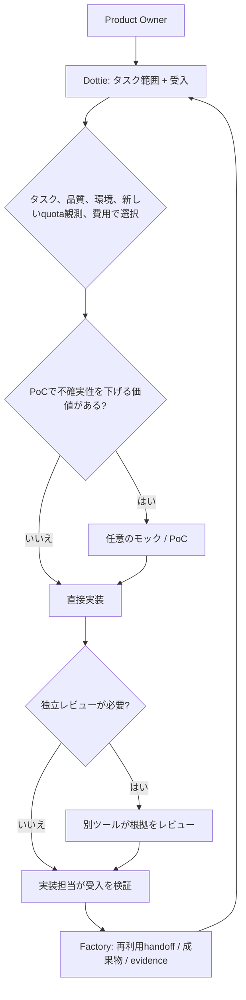

# Routing Guide

[English](routing-guide.md) | [Japanese](routing-guide.ja.md)

Windowsを常時稼働のローカル基地かつ第一選択とします。Windowsで進められない場合は、Macへ切り替える前にユーザーへ相談します。Macは補助環境です。

Task fit、environment、quota evidence、quality、costに沿って利用可能なtoolを選びます。タスクに合わない固定model sequenceは使いません。model labelは本人の運用表記で、API IDや実行時modelの確認ではありません。

## Current Snapshot - 2026-10-05

| 作業 | 開始点 | 引き上げ／代替 |
|---|---|---|
| 要件、範囲、受入条件 | Dottie PMとProduct Owner | アーキテクチャとレビューはChappy |
| 短い相談や下書き | ChatGPT Chat | 特定機能に応じて別ツールを選択 |
| 調査と成果物 | ChatGPT Work | 必要に応じてQwenなど出典を確認できるツール |
| 通常のコーディング | Claude Code / Sonnet 5.5 | 難しい作業ではOpus 5.5。適合性または明示指定によりCodex |
| Codexを指定した変更 | Luna / Low | Luna Medium → Luna High → Sol Low → Medium → High。ExtraHighは使わない |
| PoCやモック | Gemini/Antigravityも候補 | Claude Code、Codexなど適合する別ツール。PoCは任意 |
| マルチモーダル／ローカル文章 | 入力に適したQwen環境 | Colabとローカルモデルは別環境 |
| 独立レビュー | 実装担当とは異なるツール | 実装担当とタスクによりChappy/CodexまたはClaude Code |

### Codexのeffort段階

Codexを選んだ場合にのみ使います。品質やタスク難度に基づく具体的な理由をもって上げます。

```text
GPT-6 Luna / Low
  → Luna / Medium
  → Luna / High
  → GPT-6.1 Sol / Low
  → Sol / Medium
  → Sol / High
```

ExtraHighは運用方針に含みません。Astraはこのコーディング段階には含めず、個別に必要性を判断した高度な学術・技術分析に限ります。本人の運用表記からCLI IDや実行時モデルを推定しません。

### ClaudeとAntigravity

- Claude Codeは通常Sonnet 5.5です。作業に必要な場合にOpus 5.5を選びます。
- Antigravityはタスクに応じてモデルやpoolを選択できます。全体でAntigravity-Claudeを優先する規則はありません（特定作業でGemini 3.8 Flash Highを指定した選択はその作業に限り、別途指定がない限り全体defaultにしません）。
- 直接のClaude CodeとAntigravity内Claudeは別の容量poolです。

## Quotaと費用の観測

1. Sessionとweeklyの利用枠は別に扱い、各観測にwindowと時刻を記録します。
2. CodexBarの画像確認は手動です。画像の自動読み取り、ライブquota取得、完全自動routingを主張しません。
3. Antigravity GeminiとAntigravity Claude/GPTのpoolは別々で、さらにnative Claude/Codex subscriptionのpoolとも別です。API費用はsubscription quotaとは別です。
4. 5時間利用が見られないことだけでquotaが100%にリセットしたとは言えません。
5. 欠落・古い・曖昧な観測値は`unknown`とし、暗黙にrouteせず明示的／手動選択に戻します。
6. 難度、品質基準、環境適合性、観測の鮮度、消費ペース、リセット時間、費用を総合します。閾値だけのroutingでは不十分です。

quota画像、正確な残高、個別支出、認証情報、非公開セッションの内容を公開文書へ載せません。

## ワークフローの選択



Dottieが仕様化と調整を行い、Factoryが薄い再利用可能なhandoff／成果物／evidence層を提供します。AIteamBridgeは別のローカル容量／router／transport開発プロジェクトで、ライブ自律dispatchが確立済みとはしません。各層は補完関係にあり、重複する自動orchestratorではありません。

## Qwenと実行環境の境界

- WindowsのOpen WebUI/Ollamaの文章応答は本人操作で確認済みです。
- MacのOpen WebUI 0.11.4とローカルQwen2.5 3Bでローカル応答とWeb検索結果が返りました。自動orchestrationを意味しません。
- 固定Q8のColabチャットnotebookは元のマルチモーダル構成を保持します。[PR #35](https://github.com/moruku36/qwen-multimodal-colab/pull/35)はCPU CI 287件（2件skip）を報告しています。Colab/GPU inferenceとモデルdownloadは実行されていません。A100の品質・速度・VRAM・計算使用量は延期中です。
- RunPod運用PR #1は文書のみです。現行チャット候補はLinux CPU検証済みですが、CUDA、モデルdownload、inferenceはruntime pendingです。
- WebUI → OpenAI-compatible API → オンデマンドRunPod Qwenは目標設計です。API互換性は有料OpenAI利用を意味しません。自動起動、HTTP接続、自動終了は未検証です。
- Podの停止と削除は異なります。停止中も永続storageに料金がかかる場合があり、削除するとデータを失う可能性があります。

## 承認と検証の境界

ユーザー承認、実行環境の権限承認、ローカルテスト成功、稼働環境への反映は別の段階です。正規の承認が拒否されたら作業を保存して止まります。拒否を迂回するために再申請を連打したり別経路に切り替えたりしません。

- 監督付きAntigravity Webセッション1件でタスク依頼と応答を確認し、取得結果にはunit check 324件とmock browser check 25件が報告されました。これは単一結果であり、CLI稼働、一般的な自動routing、テストの独立再実行を証明しません。

日付付きの根拠と公開範囲は[運用判断記録](operating-decisions-2026-10-05.ja.md)を参照してください。
