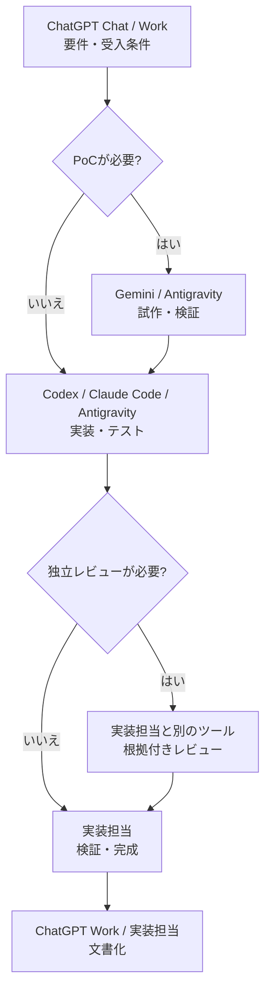

# タスク別ルーティングガイド

「どのAI / モデルに依頼するか」を即決するためのガイドです。

> **Model snapshot: 2026-09-24**
>
> モデル更新時は、モデル名そのものより「役割」を維持して置き換えます。

---

## 1. 現在の標準ルーティング

| 作業 | 第一候補 | 代替 / エスカレーション |
|---|---|---|
| 要件整理・設計・方針決め | ChatGPT Chat / Work | Claude（独立した意見が必要な場合） |
| 技術調査・比較・レポート | ChatGPT Work | ChatGPT Chat（短い比較） |
| 文章・資料作成 | ChatGPT Work | ChatGPT Chat（短い下書き） |
| PoC・モック・プロジェクト雛形 | Antigravity / Gemini 3.8 Flash | Claude Sonnet 5 |
| 初期実装・大量ファイル変更 | Antigravity / Gemini 3.8 Flash | Codex / GPT-6 Luna (Medium) |
| 小規模コード修正 | Codex / GPT-6 Luna (Low〜Medium) | Gemini 3.8 Flash |
| 通常の機能実装 | Codex / GPT-6 Luna (Medium) | Claude Code / Opus 5.5 (Medium) |
| 難しい実装・デバッグ | Codex / GPT-6 Sol (Medium) | Claude Code / Opus 5.5 (Medium) |
| 大規模migration・長期agentic coding | Claude Code / Opus 5.5 (Medium) | Codex / GPT-6 Sol (Medium) |
| コードベース横断レビュー | Claude Code / Opus 5.5 (Medium) | Codex / GPT-6 Sol (Medium) |
| レビュー指摘の単純修正 | GPT-6 Luna | Gemini 3.8 Flash |
| Sol / Opusでも解けない難問 | GPT-6 Astra | Opus 5.5 高effort |
| 機密ログ・社外秘データの整形 | Ollama / Qwen | - |

---

## 2. 開発フロー



### 開始モデルの決め方

- **仕様がまだ曖昧** → ChatGPT
- **設計の不確実性を試作で減らしたい** → Antigravity / Gemini 3.8 Flash
- **既存コードへ通常の変更を入れたい** → GPT-6 Luna / Medium
- **Lunaで設計判断・デバッグが不足する** → GPT-6 Sol / Medium
- **長く複雑なコードベース全体を扱う / 独立レビュー** → Opus 5.5 / Medium
- **外部視点でレビューしたい** → 実装担当と別ベンダーのモデル

---

## 3. エスカレーション

### Codex内

```text
GPT-6 Luna
  ↓ 設計判断・複雑なデバッグが必要
GPT-6 Sol
  ↓ Solでも解けない / 極めて重要
GPT-6 Astra
```

### Claude Code内

```text
Claude Opus 5.5 / Medium
  ↓ Mediumで不足する難バグ・大規模設計・重要レビュー
Claude Opus 5.5 / High
```

Sonnet 5は性能エスカレーション先ではなく、主に利用枠を温存したい軽量実装の代替として扱います。

### ベンダー横断

- Codexで詰まった → Claude Codeへセカンドオピニオン
- Claude Codeで詰まった → Codexへセカンドオピニオン
- どちらも詰まった → GPT-6 Astra
- 単純な物量不足 → Antigravity / Gemini 3.8 Flashへ戻す

---

## 4. 利用枠を守るルール

1. **PoCが必要なときだけ試作する**
   - 明確な既存コード修正は、実装担当へ直接渡す。
2. **CodexはLuna Mediumから始める**
   - 通常実装もまずLuna。単純作業はLow、Lunaで不足したときだけSol Mediumへ上げる。
3. **Claude CodeはOpus 5.5 Mediumを標準にする**
   - Lowは節約用、High以上はMediumで不足する難問だけ。レビューでは「Critical / Majorのみ」など粒度も限定する。
4. **実装とレビューを別系列モデルにする**
   - Codex → Claude Code、またはClaude Code → Codex。
5. **同じ実装を複数モデルへゼロから二重発注しない**
   - 比較実験を除き、利用枠の無駄になるため避ける。

---

## 5. ChatGPTの位置づけ

ChatGPT Chatは短い相談や壁打ち、Workは複数ステップの調査・文書作成・成果物に使います。

- 要件・制約の整理
- アーキテクチャ検討
- 最新情報の調査
- Codex / Claude Code / Antigravityへ渡すMaster Prompt作成
- レビュー結果の統合
- README、レポート、資料、構成図の文章設計

実際のリポジトリ操作は、原則としてCodex / Claude Code / Antigravityへ渡します。

---

## 6. ローカルモデル

Ollama / Qwenは開発能力競争には参加させず、**ローカルで処理する意味がある仕事**へ限定します。

- 機密ログの抽出
- 社外秘データの分類
- 大量テキストの前処理
- 外部AIへ送る前の匿名化・整形
