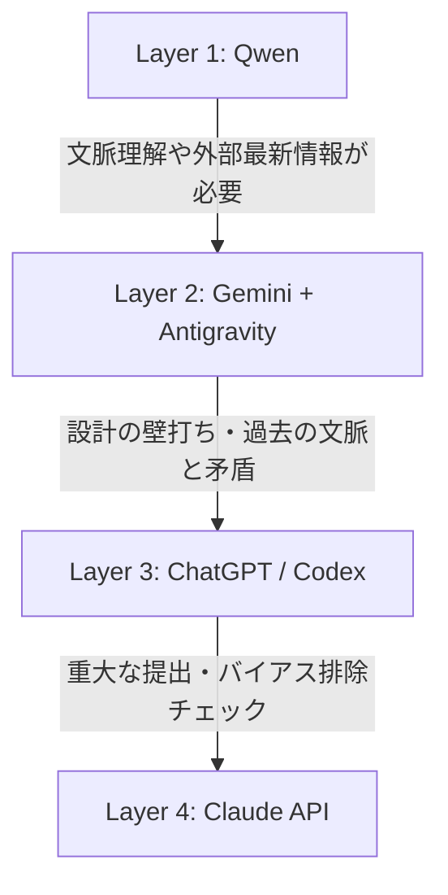

# タスク別ルーティングガイド (Routing Guide)

日々の業務や開発において、「どのモデルに依頼すべきか」を迷わず即決するための逆引きガイドです。  
エンジニアリング作業だけでなく、一般的なビジネス・リサーチ業務にも対応しています。

---

## 1. 逆引きタスク対応表

| 具体的な作業内容 | 推奨レベル | 参照レシピ |
|---|:---:|:---:|
| **社外秘データ・顧客アンケート・機密ログの整形** | **Layer 1 (Qwen)** | [レシピ 01](cookbook/01-meeting-minutes.md) |
| **CSVやJSON・議事録の定型フォーマット変換・リスト化** | **Layer 1 (Qwen)** | [レシピ 01](cookbook/01-meeting-minutes.md) |
| **最新の市場動向・ニュース・競合他社のWebリサーチ** | **Layer 2 (Gemini)** | [レシピ 02](cookbook/02-tech-selection.md) |
| **企画書・レポートの下書き作成とファイル自動生成** | **Layer 2 (Gemini)** | [レシピ 03](cookbook/03-press-release.md) |
| **プロジェクト内の複数ファイルの一括修正・コード実装** | **Layer 2 (Gemini)** | [レシピ 04](cookbook/04-code-refactor.md) |
| **日常的なビジネスメール・社内連絡文のドラフト** | **Layer 2 (Gemini)** | - |
| **新規企画のアイデア出し・ビジネス戦略の壁打ち** | **Layer 3 (ChatGPT)** | [レシピ 03](cookbook/03-press-release.md) |
| **複雑なシステム設計・抽象度の高い問題の解き方相談** | **Layer 3 (ChatGPT)** | [レシピ 02](cookbook/02-tech-selection.md) |
| **難度の高いアルゴリズム実装や難解バグの究明** | **Layer 3 (Codex)** | [レシピ 04](cookbook/04-code-refactor.md) |
| **経営陣提出前・リリース前の重要資料のリスクチェック** | **Layer 4 (Claude)** | [レシピ 03](cookbook/03-press-release.md) |
| **他モデルの出力に矛盾や違和感がある時のセカンドオピニオン** | **Layer 4 (Claude)** | [レシピ 02](cookbook/02-tech-selection.md) |

---

## 2. エスカレーション基準（モデルを切り替えるタイミング）

---

## 3. ChatGPT（Codex）利用制限時の立ち回りルール

ChatGPTやCodexの利用制限（Rate Limit）に達した際、**作業全体を止める必要はありません**。

1. **思考・骨子決めは「ChatGPT本体」で行う**
   - 「この企画方針でいく」「この構成案にする」という方針決めは、制限の緩い対話で完結させる。
2. **調査・実務・資料作成は「Gemini + Antigravity（Layer 2）」に渡す**
   - ChatGPTで固めた方針や指示プロンプトをそのままGemini（Antigravity）に貼り付け、実ファイルへの落とし込みを行わせる。
   - （例: *「ChatGPTと以下の骨子を策定した。この方針に従ってプレゼン資料のドラフトをMarkdown形式で作成せよ」*）