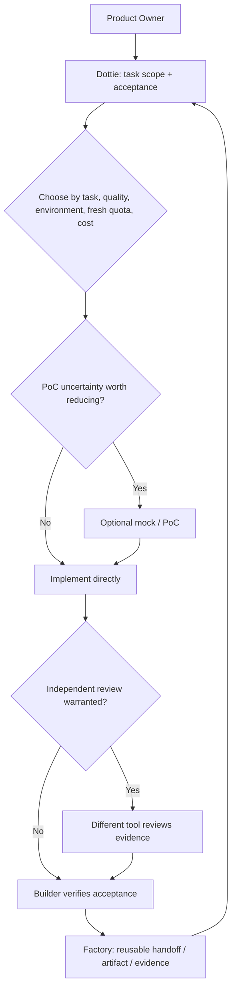

# Task Routing Guide

[English](routing-guide.md) | [日本語](routing-guide.ja.md)

Windows is the always-on local base and first choice. If it cannot proceed, consult the user before switching to Mac; Mac is a helper environment.

Choose an eligible tool for the task; do not follow a fixed model ladder when the task, environment, quota evidence, quality needs, or cost point elsewhere. Model labels are owner-reported operating names, not API IDs or proof of runtime selection.

## Current snapshot — 2026-10-05

| Work | Starting point | Escalation / alternative |
|---|---|---|
| Requirements, scope, acceptance | Dottie PM with Product Owner | Chappy for architecture and review |
| Short discussion or draft | ChatGPT Chat | Choose another tool for a specific capability |
| Research and deliverables | ChatGPT Work | Qwen or another source-capable tool as needed |
| Routine coding | Claude Code / Sonnet 5.5 | Opus 5.5 for hard work; Codex by fit or explicit choice |
| Codex-assigned changes | Luna / Low | Luna Medium → Luna High → Sol Low → Medium → High; no ExtraHigh |
| PoC or mock | Gemini/Antigravity is one candidate | Claude Code, Codex, or another fitting tool; PoC is optional |
| Multimodal/local text | Qwen environment matching the input | Colab and local model are separate environments |
| Independent review | Tool different from builder | Chappy/ Codex or Claude Code, depending on builder and task |

### Codex effort ladder

Use this only when Codex is the chosen tool. Escalate with a concrete quality or task-complexity reason:

```text
GPT-6 Luna / Low
  → Luna / Medium
  → Luna / High
  → GPT-6.1 Sol / Low
  → Sol / Medium
  → Sol / High
```

ExtraHigh is outside the operating policy. Astra is not a coding step in this ladder; reserve it for individually justified advanced academic/technical analysis. Do not infer CLI IDs or runtime model from these owner-reported labels.

### Claude and Antigravity

- Claude Code usually uses Sonnet 5.5. Select Opus 5.5 when the work merits it.
- Antigravity can use different model/pool choices for different tasks. There is no global Antigravity-Claude-first rule. A specific user choice (for example, Gemini 3.8 Flash High for one task) is limited to that task unless stated otherwise.
- Direct Claude Code and Claude inside Antigravity have separate capacity pools.

## Quota and cost observations

1. Keep session and weekly usage windows separate; label each observation with its window and time.
2. CodexBar screenshots are reviewed manually. Do not claim automatic image reading, live quota retrieval, or fully automatic routing.
3. Antigravity Gemini and Antigravity Claude/GPT pools are distinct, and separate again from native Claude/Codex subscription pools. API charges are not subscription quota.
4. Five hours without observed activity does not prove a quota reset to 100%.
5. Treat missing, stale, or ambiguous observations as `unknown`; fail closed to an explicit/manual selection.
6. Choose based on difficulty, quality bar, environment eligibility, observation freshness, consumption pace, reset window, and cost. Threshold-only routing is insufficient.

Do not put quota screenshots, exact balances, per-account spend, credentials, or private session data in public documents.

## Workflow choice


```mermaid
flowchart TD
    U["Product Owner"] --> D["Dottie: task scope + acceptance"]
    D --> C{"Choose by task, quality, environment, fresh quota, cost"}
    C --> P{"PoC uncertainty worth reducing?"}
    P -->|Yes| M["Optional mock / PoC"]
    P -->|No| I["Implement directly"]
    M --> I
    I --> V{"Independent review warranted?"}
    V -->|Yes| R["Different tool reviews evidence"]
    V -->|No| E["Builder verifies acceptance"]
    R --> E
    E --> F["Factory: reusable handoff / artifact / evidence"]
    F --> D
```

Dottie specifies and coordinates. The Factory provides a thin reusable handoff/artifact/evidence layer. AIteamBridge is the separate local capacity/router/transport engineering project; it is not established as live autonomous dispatch. These are complementary boundaries, not duplicate automatic orchestrators.

## Qwen and runtime boundaries

- Windows Open WebUI/Ollama text responses have been checked through user operation.
- Mac Open WebUI 0.11.4 with local Qwen2.5 3B returned local responses and web-search results; that does not establish automated orchestration.
- The fixed-Q8 Colab chat notebook preserves its original multimodal setup. [PR #35](https://github.com/moruku36/qwen-multimodal-colab/pull/35) reports 287 CPU CI tests (2 skipped); no Colab/GPU inference or model download was run. A100 quality, speed, VRAM, and compute use remain deferred.
- RunPod operations PR #1 is documentation-only. The current chat candidate passed Linux CPU validation; CUDA, model download, and inference remain runtime-pending.
- WebUI → OpenAI-compatible API → on-demand RunPod Qwen is a target design. API compatibility does not imply paid OpenAI. Automatic startup, HTTP connection, and termination are not verified.
- Pod stop and Pod deletion differ: persistent storage may continue to incur charges while stopped, and deletion can remove data.

## Authorization and verification boundaries

User approval, execution-environment authorization, local test success, and changes reflected in a live environment are separate stages. If the appropriate approval is rejected, preserve the work and stop. Do not repeatedly resubmit or switch routes to bypass a rejection.

Report each state precisely: **verified/merged**, **local/offline**, **runtime pending**, or **proposal**. A successful offline test does not prove a live send, deployed change, or automatic integration. Windows CLI startup has a reported rejection with unknown root cause; do not describe the CLI as fully operational.

For current dated evidence and privacy boundaries, see the [operating decisions](operating-decisions-2026-10-05.md).
