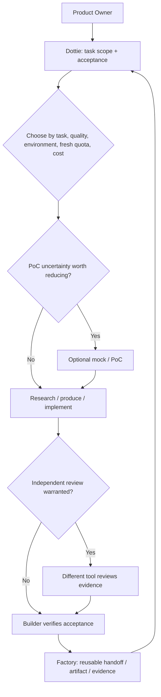

# Task Routing Guide

[English](routing-guide.md) | [日本語](routing-guide.ja.md)

Windows is the always-on local base and first choice. If it cannot proceed, consult the user before switching to Mac; Mac is a helper environment.

Choose an eligible tool for the task; do not follow a fixed model ladder when the task, environment, quota evidence, quality needs, or cost point elsewhere. Model labels are owner-reported operating names, not API IDs or proof of runtime selection.

## Current snapshot — 2026-10-10

| Work | Main candidate | Alternative / review |
|---|---|---|
| Short requirements, acceptance, allocation, progress | Dottie with owner | Codex / ChatGPT only for complex design/difficult decisions |
| Research, official sources, comparisons, summaries, chart data | Antigravity | Suitable Claude; local Qwen for authorized source organization |
| Technical docs, blog drafts, editing, translation | Claude | Antigravity alternative prose and first review |
| Implementation, fixes, tests | Claude or Antigravity | Different-provider review where possible |
| PoCs / mocks | Antigravity or Claude | Only to reduce meaningful uncertainty |
| General repo edits, GitHub docs, PR preparation | Claude | Antigravity; another worker checks diff/links |
| Independent first review | Different provider from author where possible | Claude / Antigravity mutual review now; Codex only for difficult points |
| Authorized specialist research | Windows / Mac local Qwen | Verify search/source capabilities per environment |
| Future independent review | RunPod A100 Qwen (unaccepted) | Claude / Antigravity for now |

Roles are candidate assignments; allocate by fit, capacity freshness and availability. Full-text Codex substitution and comprehensive re-review are not the default.

### Two Medium choices for routine OpenAI work

Routine OpenAI selection uses only **GPT-6 Luna / Medium** or **GPT-6.1 Sol / Medium**. Choose Luna Medium for bounded work and Sol Medium when complexity or the quality bar warrants it; there is no Low/Medium/High six-step ladder. ExtraHigh remains outside the policy. Astra is an exception only when academic research or particularly difficult advanced investigation needs it, with a concrete reason; use Sol Medium when sufficient. These are owner-reported labels, not CLI IDs or proof of runtime availability.

Record requested worker model/effort separately from observed runtime model/effort. If actual worker selection cannot be made or verified, report that limitation and mark the observation `UNKNOWN`. Do not claim selection succeeded or silently substitute another model.

### Claude and Antigravity

- Claude Code usually uses Sonnet 5.5. Select Opus 5.5 when the work merits it.
- Antigravity can use different model/pool choices for different tasks. There is no global Antigravity-Claude-first rule. A specific user choice (for example, Gemini 3.8 Flash High for one task) is limited to that task unless stated otherwise.
- Direct Claude Code and Claude inside Antigravity have separate capacity pools.

## Allocation and handoff failure

1. Record the goal, completion criteria, small input, worker, one alternative, planned budget/work limit, and artifact/evidence for each task.
2. Confirm the authorized route is available and actually working. Separate subscription/API and provider pools, timestamped session/weekly capacity, and reset times. Missing/stale values are `unknown`. Do not add unlike provider token units to equalize work.
3. First allocate to a fitting Claude / Antigravity candidate with available capacity. The role table is not a fixed assignment. Manual rotation when observations are stale is a proposal to reduce concentration, not proof of sufficient capacity.
4. After one failed handoff, preserve the cause and artifacts. Stop on authorization denial; do not bypass it through another route. For ordinary availability failures, consider one other authorized candidate. If none works, mark `blocked` / awaiting owner handoff; do not automatically return to full-text Codex substitution. Record a short reason for exceptions.
5. Separate builder/author and reviewer by provider where possible. Claude inside Antigravity and native Claude Code have separate pools but share a provider. Review the specified scope, evidence and major unknowns; escalate only difficult points to Codex when needed.

## Quota and cost observations

1. Keep session and weekly usage windows separate; label each observation with its window and time.
2. CodexBar screenshots are reviewed manually. Do not claim automatic image reading, live quota retrieval, or fully automatic routing.
3. Antigravity Gemini and Antigravity Claude/GPT pools are distinct, and separate again from native Claude/Codex subscription pools. API charges are not subscription quota.
4. Five hours without observed activity does not prove a quota reset to 100%.
5. Treat missing, stale, or ambiguous observations as `unknown`; fail closed to an explicit/manual selection.
6. Choose based on difficulty, quality bar, environment eligibility, observation freshness, consumption pace, reset window, and cost. Threshold-only routing is insufficient.

Do not put quota screenshots, exact balances, per-account spend, credentials, or private session data in public documents.

## Work routing examples

| Work | Allocation example | Evidence and acceptance |
|---|---|---|
| Research, blogs and docs | Antigravity research/official sources → Claude draft/edit/translation → Antigravity chart data → different-provider review → owner approval → authorized publisher | Source URLs/dates, draft revision, numeric data, findings/fixes. Four-channel blog drafts remain unpublished before owner review |
| Code, fixes and tests | Short Dottie specification → Codex initial design if needed → Claude or Antigravity implementation/tests → different-provider review → worker fixes/rechecks → owner acceptance | Diff, checks and unverified runtime; review does not become a complete reimplementation |
| General repo edits and PR preparation | Small input + edit scope → Claude docs/PR preparation (alternative Antigravity) → another worker checks diff/links → authorized upload | Branch, changed files, preserved existing changes and readback. Merge only within separately explicit authorization |
| Authorized specialist research | Local Qwen organizes sources → search-capable worker checks official sources → scoped Claude / Antigravity review → owner decision | Environment/model observations, permitted scope, sources/unknowns; no role change to bypass safety features |

## Workflow choice

```mermaid
flowchart TD
    U["Product Owner"] --> D["Dottie: task scope + acceptance"]
    D --> C{"Choose by task, quality, environment, fresh quota, cost"}
    C --> P{"PoC uncertainty worth reducing?"}
    P -->|Yes| M["Optional mock / PoC"]
    P -->|No| I["Research / produce / implement"]
    M --> I
    I --> V{"Independent review warranted?"}
    V -->|Yes| R["Different tool reviews evidence"]
    V -->|No| E["Builder verifies acceptance"]
    R --> E
    E --> F["Factory: reusable handoff / artifact / evidence"]
    F --> D
```

Dottie specifies and coordinates. The Factory provides a thin reusable handoff/artifact/evidence layer. AIteamBridge is the separate local capacity/router/transport engineering project; it is not established as live autonomous dispatch. These are complementary boundaries, not duplicate automatic orchestrators.

## Qwen and runtime boundaries

- **Local:** Windows Open WebUI/Ollama text responses were owner-checked. Mac Open WebUI 0.11.4 with Qwen2.5 3B has past observations of local responses and web-search results. Search availability and specialist-research quality require environment-specific checks; this is not automated orchestration.
- **RunPod Phase 1:** [PR #39](https://github.com/moruku36/qwen-multimodal/pull/39) records one real response from small Qwen2.5-1.5B-Instruct and Pod deletion. It does not accept A100 independent-review quality or the complete workflow.
- **RunPod Phase 2:** Mock/offline only. Live A100 independent review, quality and ongoing operation are not accepted. Use Claude / Antigravity mutual review for now. The conversational label “around 3.7” is unresolved and is not a model ID.
- **Colab:** The fixed-Q8 chat notebook is separate. [PR #35](https://github.com/moruku36/qwen-multimodal-colab/pull/35) reports 287 CPU CI checks (2 skipped), not Colab/GPU inference, model-download or A100-quality verification.
- OpenAI-compatible describes an API shape, not paid OpenAI. A single HTTP response does not establish automatic startup, connection and termination. Pod stop and deletion differ, including storage costs and data retention. This documentation change starts no GPU and changes no runtime settings.

## Authorization and verification boundaries

User approval, execution-environment authorization, local test success, and changes reflected in a live environment are separate stages. If the appropriate approval is rejected, preserve the work and stop. Do not repeatedly resubmit or switch routes to bypass a rejection.

Report each state precisely: **verified/merged**, **local/offline**, **runtime pending**, or **proposal**. A successful offline test does not prove a live send, deployed change, or automatic integration. Windows CLI startup has a reported rejection with unknown root cause; do not describe the CLI as fully operational.

For current dated evidence and privacy boundaries, see the [operating decisions](operating-decisions-2026-10-10.md).
