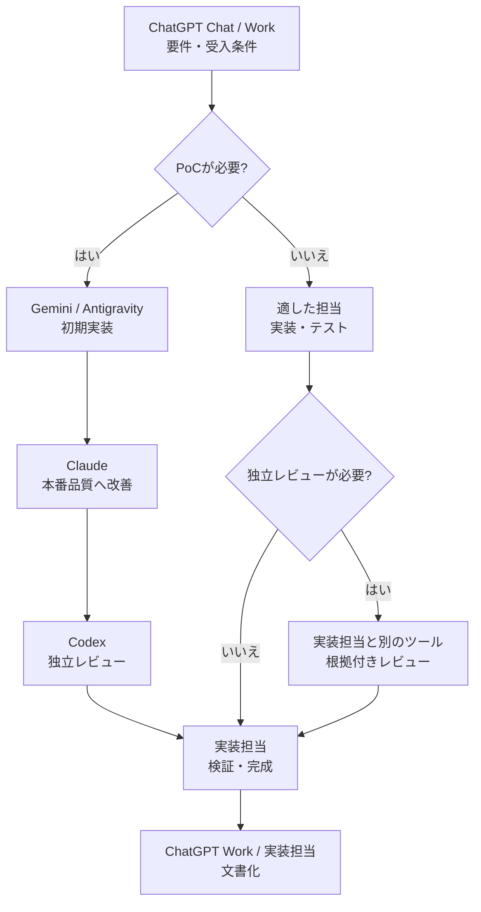

# タスク別ルーティングガイド

「どのAI / モデルに依頼するか」を即決するためのガイドです。Dottie（ドッティ）がPMとして使う場合も、このルールを基準にします。呼称とチーム内役割は [AI Team](ai-team.md) を参照してください。

> **Model snapshot: 2026-10-01**
>
> モデル更新時は、モデル名そのものより「役割」を維持して置き換えます。

---

## 1. 現在の標準ルーティング

| 作業 | 第一候補 | 代替 / エスカレーション |
|---|---|---|
| 要件整理・設計・方針決め | ChatGPT Chat / Work | Claude（独立した意見が必要な場合） |
| 技術調査・比較・レポート | ChatGPT Work | ChatGPT Chat（短い比較） |
| 文章・資料作成 | ChatGPT Work | ChatGPT Chat（短い下書き） |
| PoC・モック・新規プロジェクト雛形 | Gemini 3.8 Flash / Antigravity → Claudeで仕上げ → Codexが独立レビュー | 指定AIがあればそれを優先 |
| 初期実装・大量ファイル変更 | Gemini 3.8 Flash / Antigravity → Claudeで仕上げ → Codexが独立レビュー | 既存作業の修正は適した担当へ |
| 小規模コード修正 | Codex / GPT-6 Luna (Lowから) | Gemini 3.8 Flash |
| 通常の機能実装・文章作成 | Codex / GPT-6 Luna (Lowから) | Claude Code / Sonnet 5.5 (Medium effort) |
| 難しい実装・デバッグ | Codexを段階的に昇格。Claude Opus 5.5は難しい作業に限る | ユーザー指定のAI |
| 大規模migration・長時間agentic coding | Claude Code / Sonnet 5.5 | Codex / GPT-6 Luna (Lowから。必要な場合のみ段階的に昇格) |
| コードベース横断レビュー | Claude Code / Sonnet 5.5。難しい作業のみOpusへ昇格 | Codex / GPT-6.1 Sol |
| レビュー指摘の単純修正 | GPT-6 Luna | Gemini 3.8 Flash |
| Solでも解けない難問 | GPT-6 Astra (reserved, not routine) | Claude Opus 5.5 |
| 画像理解・画像生成/編集・PDF/短動画・音声入力 | Qwen Multimodal Colab（利用可能な場合） | 用途に合う別の担当 |
| GitHubリポジトリの読み取り専用調査 | ローカルQwen 14B（テキスト）/ Colab（マルチモーダル、利用可能な場合） | ChatGPT / Codex |

---

## 2. 開発フロー


```mermaid
flowchart TD
    P["ChatGPT Chat / Work<br/>要件・受入条件"] --> Q{"PoCが必要?"}
    Q -->|はい| G["Gemini / Antigravity<br/>初期実装"]
    Q -->|いいえ| C["適した担当<br/>実装・テスト"]
    G --> H["Claude<br/>本番品質へ改善"]
    H --> X["Codex<br/>独立レビュー"]
    X --> F
    C --> R{"独立レビューが必要?"}
    R -->|はい| V["実装担当と別のツール<br/>根拠付きレビュー"]
    R -->|いいえ| F["実装担当<br/>検証・完成"]
    V --> F
    F --> D["ChatGPT Work / 実装担当<br/>文書化"]
```

### 開始モデルの決め方

- **仕様がまだ曖昧** → ChatGPT
- **設計の不確実性を試作で減らしたい** → Antigravity / Gemini 3.8 Flash
- **既存コードへ通常の変更・文章作成をしたい** → GPT-6 Luna / Low
- **Luna Lowで不足する** → GPT-6 Luna / Medium、必要ならHigh、その後にGPT-6.1 Sol / Medium
- **新規モック / PoC / 大量初期コード** → Gemini / Antigravity、Claudeで仕上げ、Codexで独立レビュー
- **難しい仕事** → Claude Opus 5.5を検討
- **外部視点でレビューしたい** → 実装担当と別ベンダーのモデル

---

## 3. エスカレーション

### Codex内

```text
GPT-6 Luna / Low
  ↓ Lowで不足する具体的理由がある
GPT-6 Luna / Medium
  ↓ Mediumでも不足する具体的理由がある
GPT-6 Luna / High
  ↓ Highでも不足する具体的理由がある
GPT-6.1 Sol / Medium
  ↓ 解けない難問で、必要性を個別判断
GPT-6 Astra
```

各段階でエスカレーション理由を記録し、テストと適切な独立レビューを維持します。Astraは通常の選択肢ではありません。

### Claude Code内

```text
Claude Sonnet 5.5 / Medium effort（現在の設定はユーザー申告）
  ↓ 難しい作業に限り
Claude Opus 5.5
```

Sonnet 5.5が標準です。Opus 5.5は難しい仕事に限ります。

### ベンダー横断

- Codexで詰まった → Claude Codeへセカンドオピニオン
- Claude Codeで詰まった → Codexへセカンドオピニオン
- どちらも詰まった → GPT-6 Astra
- 単純な物量不足 → Antigravity / Gemini 3.8 Flashへ戻す

---

## 4. 利用枠を守るルール

1. **PoCが必要なときだけ試作する**
   - 明確な既存コード修正は、実装担当へ直接渡す。
2. **Codexの文章・コード作成はLuna Lowから始める**
   - Luna Medium → Luna High → GPT-6.1 Sol Mediumの順に、必要なときだけ上げて理由を明示する。
3. **Claude CodeはSonnet 5.5を標準にする**
   - 現在のeffort設定はユーザー申告でMedium。Opus 5.5は難しい仕事に限る。
4. **実装とレビューを別系列モデルにする**
   - Codex → Claude Code、またはClaude Code → Codex。
5. **同じ実装を複数モデルへゼロから二重発注しない**
   - 比較実験を除き、利用枠の無駄になるため避ける。
6. **Dottieは残量とリセット時刻もルーティング入力にする**
   - Geminiは通常High effortで使う。残量が少ない場合は、リセット時刻と作業難度を見てMediumを優先する。残量50%未満は目安であり、token消費量の削減を保証しない。残量30%未満ではその提供元を温存し、枯渇・利用不可時は別の提供元へ振り替える。AntigravityのGemini用枠とClaude/GPT用枠は、Claude/Codexの個別アカウントの枠と分け、残量を合算しない。各アカウントの利用枠、リセット日時、追加クレジット、有効期限を個別に管理する。詳細は [Dots + CodexBar Orchestration Plan](dots-codexbar-orchestration.md)。
7. **Windowsをローカル主拠点にする**
   - Macへの切り替えはWindowsで作業を進められない場合に限り、所有者が端末を操作できる時間を事前に確認して調整する。環境トラブルや設定では、Antigravityが利用可能で利用枠に余裕があれば優先し、Dottieが結果を検証する。セキュリティやネットワーク設定に関わる変更には事前承認が必要で、EDRを迂回しない。GUIを導入済みでも遠隔操作やCLI認証が可能とは限らないため、実際の機能を確認する。Antigravity CLIを使う場合は、一般利用者向けの公式手段を優先する。

---

## 5. ChatGPTの位置づけ

ChatGPT Chatは短い相談や壁打ち、Workは複数ステップの調査・文書作成・成果物に使います。

- 要件・制約の整理
- アーキテクチャ検討
- 最新情報の調査
- Codex / Claude Code / Antigravityへ渡すMaster Prompt作成
- レビュー結果の統合
- README、レポート、資料、構成図の文章設計

実際のリポジトリ操作は、原則としてCodex / Claude Code / Antigravityへ渡します。

---

## 6. Qwen Multimodal Colab

Colabが使えない間は、テキスト作業に**ローカルQwen 14B**を優先します。[Qwen Multimodal Colab](https://github.com/moruku36/qwen-multimodal-colab)は別環境であり、画像・PDF・動画・音声などのマルチモーダル機能はColab側の用途です。ローカル14Bについて、Ollamaがバックエンドであること、マルチモーダル機能、自動呼び出しを仮定しません。

推奨構成は **Google Colab A100 80GB + Qwen3.8-27B Q8_K_L + Qwen-Image-2.1** です。

向いている用途:
- Chat / Vision
- 画像生成・画像編集
- PDF・短い動画の読解
- 音声入力・読み上げ
- Web検索を併用した調査
- GitHub URLを渡したRead-onlyのリポジトリ調査

注意:
- Google Colab / Google Drive / 外部検索サービスを利用し得るため、ローカルLLMと同じ機密性は前提にしない。
- 機密情報や社外秘データは、利用ルールを確認してから投入する。
- 旧 `configs/level1-ollama/` はLegacyとして残すが、標準ルーティングからは外す。

---

## 7. Execution Security

Task Routing（誰に任せるか）の下に、任意のレイヤーとして Execution Security（何を許可するか）を置きます。ここまでの表・エスカレーション・モデル選択は変わりません。OpenShellはモデル階層に入れず、ルーティングの入力にもしません。

```text
Task Routing        … 誰に任せるか（Codex / Claude Code / ...）
  ↓
Execution Security  … 何を許可するか（OpenShell: FS・ネットワークをdefault-deny）
```

### 使い分け

| レビューの種類 | 実行方法 |
|---|---|
| 重要repo / セキュリティ重視のレビュー | [OpenShell Claude Reviewer](https://github.com/moruku36/openshell-claude-reviewer) |
| 通常の軽いレビュー | 従来の Claude Code |

全てのClaude Code実行にOpenShellを必須とはしません。

### Builder と Reviewer の権限分離

| 役割 | 担当 | repo | GitHub |
|---|---|---|---|
| Builder | Codex | READ / WRITE | PR作成などの書き込み可 |
| Reviewer | Claude Code（OpenShell内） | READ | WRITE DENY（push、PR/Issue書き込み、他ホストへの通信） |

「Reviewerはpushしない」をプロンプトではなくポリシーで強制するため、レビュー対象コードにプロンプトインジェクションが含まれていても、書き込みは実行できません。

### 検証状況

- 検証済み: サンドボックス境界のdenyチェック 13/13
- **未確認**: 本物のAnthropic APIキーで、実際にAnthropicへ接続する `review.sh` によるレビュー

未確認の部分が確認できたら、この節を更新します。レビュー対象のコードはAnthropic APIへ送信される点は従来のClaude Codeと同じです。
